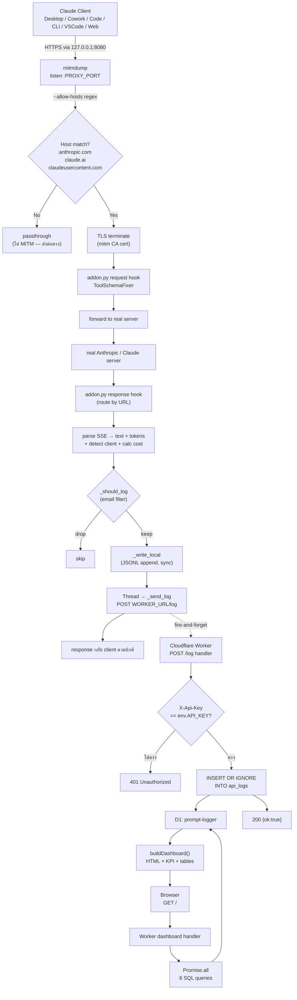
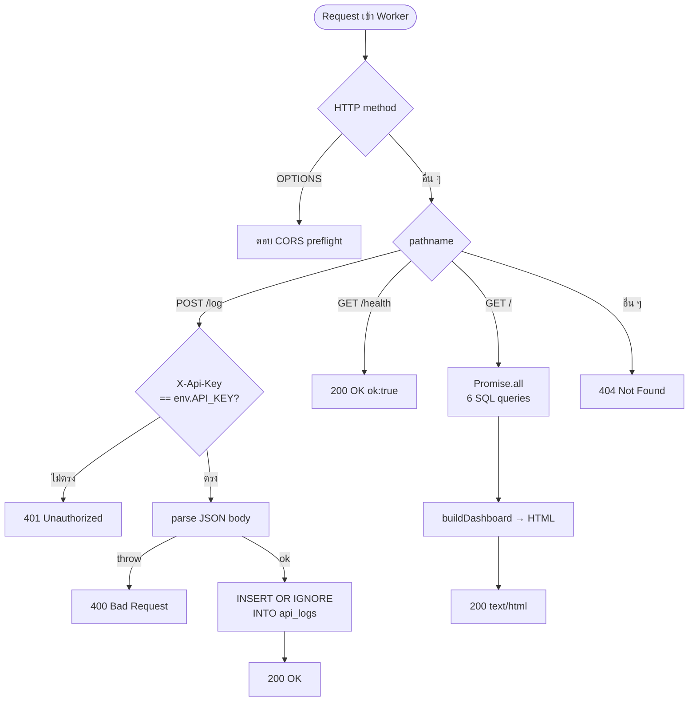
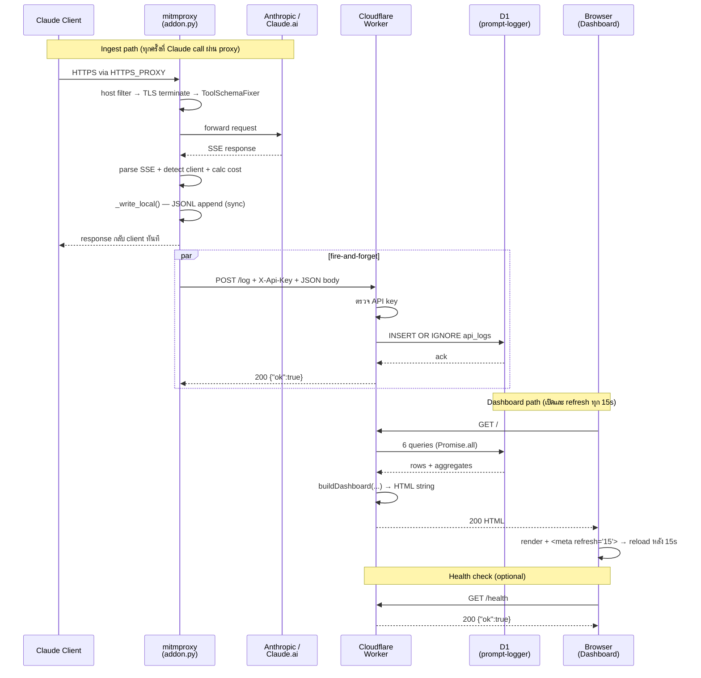

# Guide Flow — คู่มือ Flow การทำงานรวม (Proxy + Worker)

คู่มือนี้รวม **เฉพาะส่วน Flow การทำงาน** จาก [proxy/PROXY-GUIDE.md](proxy/PROXY-GUIDE.md) และ [worker/WORKER-GUIDE.md](worker/WORKER-GUIDE.md) มาให้เห็นภาพ end-to-end ในที่เดียว

> สำหรับ install / config / result-schema / demo ดูที่ guide ต้นทางแต่ละฝั่ง
> ภาพรวมทั้ง stack ดูที่ [README.md](README.md)

---

## สารบัญ

1. [Pipeline ภาพรวม](#1-pipeline-ภาพรวม)
2. [Master flowchart (end-to-end)](#2-master-flowchart-end-to-end)
3. [ฝั่ง Proxy — Flow การทำงาน](#3-ฝั่ง-proxy--flow-การทำงาน)
4. [ฝั่ง Worker — Flow การทำงาน](#4-ฝั่ง-worker--flow-การทำงาน)
5. [End-to-end lifecycle (sequence)](#5-end-to-end-lifecycle-sequence)

---

## 1. Pipeline ภาพรวม

```
┌──────────────┐  HTTPS  ┌──────────────┐  POST /log  ┌────────────────┐   SQL   ┌──────────────┐
│ Claude       │ ──────► │  mitmproxy   │ ──────────► │  Cloudflare    │ ──────► │ Cloudflare   │
│ clients      │ via env │  (addon.py)  │ X-Api-Key   │  Worker        │         │ D1 database  │
│ (CLI/Desktop │ HTTPS_  │              │             │                │ ◄────── │ "prompt-     │
│ /VSCode/web) │ PROXY   │              │             │                │   SQL   │  logger"     │
└──────────────┘         └──────────────┘             │                │         └──────────────┘
                                                      │                │  GET /
                                                      │                │ ◄─────── ┌──────────────┐
                                                      │                │  HTML──► │ Browser      │
                                                      └────────────────┘          │ (Dashboard)  │
                                                                                  └──────────────┘
```

3 องค์ประกอบ — **1 Pipeline ทิศทางเดียว**:

| Layer | บทบาท | หน้าที่ใน flow |
|---|---|---|
| **Claude clients** | ต้นทาง traffic | ตั้ง `HTTPS_PROXY=127.0.0.1:8080` + trust mitm CA cert |
| **mitmproxy (proxy/)** | MITM intercept | TLS terminate → parse SSE → คิดราคา → JSONL local + POST Worker |
| **Cloudflare Worker (worker/)** | backend + UI | รับ `POST /log` → D1 + เสิร์ฟ Dashboard ที่ `GET /` |

---

## 2. Master flowchart (end-to-end)



---

## 3. ฝั่ง Proxy — Flow การทำงาน

> ย่อจาก [proxy/PROXY-GUIDE.md §3](proxy/PROXY-GUIDE.md#3-flow-การทำงาน) — เก็บเฉพาะลำดับขั้นและ routing

### 3.1 Step-by-step

1. **Client → Proxy**
   Client ที่ตั้ง `HTTPS_PROXY=http://127.0.0.1:8080` จะส่งทุก HTTPS request ผ่าน `mitmdump` ก่อน

2. **Host filter ที่ mitmdump**
   `start.ps1` เรียก mitmdump ด้วย `--allow-hosts "(anthropic\.com|claude\.ai|claudeusercontent\.com)"` — host อื่นทั้งหมด **pass-through** โดยไม่ MITM (ไม่กระทบ Slack / GitHub / npm registry ฯลฯ)

3. **TLS termination**
   เฉพาะ host ที่ match — mitm ใช้ self-signed CA cert (`~/.mitmproxy/mitmproxy-ca-cert.pem`) ออก leaf cert ใหม่ตามชื่อ SNI ที่ขอ → client trust ได้เพราะ CA อยู่ใน Trusted Root

4. **Request hook — `ToolSchemaFixer`** (สำคัญ)
   ก่อน forward ไป Anthropic — hook scan `tools[]` ใน body แล้วถ้า `input_schema` มี `oneOf` / `allOf` / `anyOf` ที่ root **flatten** เป็น `{"type":"object","additionalProperties":true}` ก่อน
   **เหตุผล:** Anthropic API จะ reject schema แบบนี้ด้วย error `tools.N.custom.input_schema: input_schema does not support oneOf, allOf, or anyOf at the top level`

5. **Forward → real server → response**
   mitmproxy ยิงต่อไป Anthropic จริงๆ ได้ SSE stream กลับมา

6. **Response hook — route ไป Monitor class**

   | Class | Endpoint | Client tag |
   |---|---|---|
   | `ClaudeAPIMonitor` | `api.anthropic.com/v1/messages` (รวม `?beta=true`) | `claude-code-cli` / `claude-code-vscode` / `claude-desktop-code` / `claude-desktop-cowork` / `api` |
   | `ClaudeDesktopMonitor` | `claude.ai/.../chat_conversations/.../completion` | `claude-desktop` |
   | `ClaudeBridgeMonitor` | `bridge.claudeusercontent.com` WebSocket | `claude-code-cli` / `claude-code-vscode` / `browser-extension` |
   | `ClaudeAccountSniffer` | `/api/auth/current_account`, `/api/account`, `/api/bootstrap/...` | — (cache email) |

7. **Parse + classify + price**
   - Parse SSE stream → ข้อความ response + token counts (input/output/cache_create/cache_read)
   - `_detect_client(headers)` ดู `user-agent` / `anthropic-client-name` / `x-app` / `x-client-context`
   - **Body heuristic:** มี `mcp__cowork__*` → override เป็น `claude-desktop-cowork` / มี Code tools → fallback `claude-code-cli`
   - `_calc_cost(model, tokens)` — คิด USD ตาม tier (Opus / Sonnet / Haiku)

8. **Filter + persist**
   - `_should_log(email)` — ถ้าเปิด `EMAIL_FILTER_ENABLED` จะ drop call ที่ email ไม่ match
   - `_write_local(payload)` — append JSON 1 บรรทัดลง `log/claude_YYYY-MM-DD.jsonl` (**sync**)
   - `threading.Thread(_send_log, payload)` — POST ไป Worker ใน thread แยก (**fire-and-forget**)

9. **Response กลับไปที่ client**
   Client ไม่รู้สึกว่าถูก intercept

### 3.2 จุดที่ "ยิง API" ไปเก็บ log ที่ Worker (code map)

ฟังก์ชัน `_send_log` ที่ [proxy/addon.py:320-342](proxy/addon.py#L320-L342) — เปิด socket ที่ **bypass system proxy** เพื่อกัน loopback กลับเข้า mitmproxy เอง แล้ว POST JSON เข้า `{WORKER_URL}/log`

```python
_no_proxy_opener = urllib.request.build_opener(urllib.request.ProxyHandler({}))

def _send_log(payload: dict):
    try:
        body = json.dumps(payload).encode()
        req  = urllib.request.Request(f"{WORKER_URL}/log", data=body, method="POST")
        req.add_header("Content-Type", "application/json")
        req.add_header("X-Api-Key",    API_KEY)
        req.add_header("User-Agent",   "Mozilla/5.0 (claude-monitor mitmproxy addon)")
        resp = _no_proxy_opener.open(req, timeout=8)
        ...
```

3 จุดที่เรียก `_send_log` (1 ที่ต่อ monitor class):

| Monitor class | บรรทัด | endpoint ที่ดักได้ |
|---|---|---|
| `ClaudeAPIMonitor.response` | [addon.py:518](proxy/addon.py#L518) | `api.anthropic.com/v1/messages` |
| `ClaudeDesktopMonitor.response` | [addon.py:610](proxy/addon.py#L610) | `claude.ai/.../completion` |
| `ClaudeBridgeMonitor.websocket_message` | [addon.py:955](proxy/addon.py#L955) | `bridge.claudeusercontent.com` WS |

ทั้ง 3 จุดเรียกแบบเดียวกัน — local write ก่อนแล้วค่อย spawn thread:

```python
_write_local(log)                                                    # sync — ห้ามพลาด
threading.Thread(target=_send_log, args=(log,), daemon=True).start() # async fire-and-forget
```

---

## 4. ฝั่ง Worker — Flow การทำงาน

> ย่อจาก [worker/WORKER-GUIDE.md §2](worker/WORKER-GUIDE.md#2-flow-การทำงาน) — เก็บเฉพาะ routing/handler และ behavior ของแต่ละ path

### 4.1 Flowchart รวม



### 4.2 Path 1 — `POST /log` (ingest จาก proxy)

ขั้นตอนใน [worker/src/index.ts:256-289](worker/src/index.ts#L256-L289):

```
1. ตรวจ method + path → "POST /log"
2. อ่าน header X-Api-Key เทียบกับ env.API_KEY
   ├─ ไม่ตรง → 401 JSON
   └─ ตรง → ไปต่อ
3. await request.json() เป็น Partial<ApiLog>
   └─ ถ้า parse fail → 400 JSON พร้อม error
4. INSERT OR IGNORE INTO api_logs (...) VALUES (?,?,?,?,...) 15 placeholders
   - ทุก field มี default value (?? operator)
   - id ?? crypto.randomUUID()
   - ts ?? Date.now()
5. ตอบ 200 {ok:true}
```

**จุดสังเกตสำคัญ:**

- **Idempotency:** `INSERT OR IGNORE` — id ซ้ำ → ignore เงียบ ๆ → ปลอดภัยกับ retry ของ proxy
- **Defensive defaults:** ทุก field มี `?? default` — proxy ส่งฟิลด์มาไม่ครบ Worker ไม่ crash
- **Async I/O:** `await ...run()` block จนกว่า D1 commit → client ได้รับ 200 หลังเขียนจริง

| Status | Body | เมื่อไร |
|---|---|---|
| 200 | `{"ok":true}` | INSERT สำเร็จ หรือ id ซ้ำ |
| 400 | `{"ok":false,"error":"..."}` | JSON parse fail / D1 error |
| 401 | `{"ok":false,"error":"Unauthorized"}` | `X-Api-Key` ไม่ตรง |

### 4.3 Path 2 — `GET /health`

[index.ts:292](worker/src/index.ts#L292):

```typescript
if (pathname === '/health') return json({ ok: true });
```

ไม่ query D1 ไม่มี auth — ใช้กับ uptime monitor / curl

### 4.4 Path 3 — `GET /` (Dashboard)

ขั้นตอนใน [index.ts:295-326](worker/src/index.ts#L295-L326):

```
1. รัน 6 queries พร้อมกันด้วย Promise.all
   ├─ Q1: SELECT * FROM api_logs ORDER BY ts DESC LIMIT 100
   ├─ Q2: SELECT totals (calls, in, out, cache_read, cache_create, cost)
   ├─ Q3: GROUP BY model
   ├─ Q4: GROUP BY client
   ├─ Q5: GROUP BY machine_name
   └─ Q6: GROUP BY account_email
2. ส่งผลเข้า buildDashboard(...) → HTML string
3. ตอบ HTML + Content-Type: text/html;charset=utf-8
```

**ทำไม Promise.all:** ทั้ง 6 query อิสระจากกัน — ส่งพร้อมกันใช้ wall-time ของ query ที่ช้าที่สุดเท่านั้น

### 4.5 Path 4 — CORS preflight

[index.ts:251-253](worker/src/index.ts#L251-L253) — รับ OPTIONS ทุก path → ตอบ allow-all

### 4.6 Path 5 — 404 fallback

[index.ts:329](worker/src/index.ts#L329) — ทุก request ที่ไม่ match → JSON 404

### 4.7 Error handling — ที่ครอบคลุม

| สถานการณ์ | ผลลัพธ์ |
|---|---|
| `X-Api-Key` ไม่ตรง / ไม่ส่ง | 401 JSON |
| Body ไม่ใช่ JSON / parse fail | 400 JSON พร้อม error message |
| D1 error (network / quota / lock) | 400 JSON พร้อม error message |
| Field ขาด / type ผิด | INSERT ผ่านด้วย default (`''` หรือ `0`) |
| `id` ซ้ำ | IGNORE — ตอบ 200 ตามปกติ (idempotent) |
| Method ที่ไม่รองรับ | fallback → 404 |

---

## 5. End-to-end lifecycle (sequence)



**จุดที่ควรรู้ของ lifecycle รวม:**

- **Proxy decoupled จาก Worker** — `_send_log` เป็น fire-and-forget thread แยก ถ้า Worker ล่ม proxy ยังบันทึก local ปกติ ไม่ block client
- **JSONL local เป็น source of truth** — Worker เป็น downstream (ตามชื่อ); ลบ JSONL ไม่กระทบ D1 และในทางกลับ
- **Idempotent pipeline** — ทั้ง proxy gen `id` ก่อน + Worker `INSERT OR IGNORE` → retry กี่ครั้งก็ไม่ duplicate
- **Auto-refresh ขับด้วย `<meta refresh="15">`** — Worker ไม่ push, browser pull เอง — เหมาะกับ Cloudflare Worker ที่ไม่ stateful

---

## ลิงก์ที่เกี่ยวข้อง

- [proxy/PROXY-GUIDE.md](proxy/PROXY-GUIDE.md) — รายละเอียดฝั่ง proxy ฉบับเต็ม (install / config / result / demo)
- [worker/WORKER-GUIDE.md](worker/WORKER-GUIDE.md) — รายละเอียดฝั่ง worker ฉบับเต็ม (endpoints / schema / dashboard)
- [README.md](README.md) — ภาพรวมทั้ง stack
- [SETUP.md](SETUP.md) — install Worker + D1 + Proxy ครบ
- [DEVELOPER.md](DEVELOPER.md) — เพิ่มฟีเจอร์ / extend
