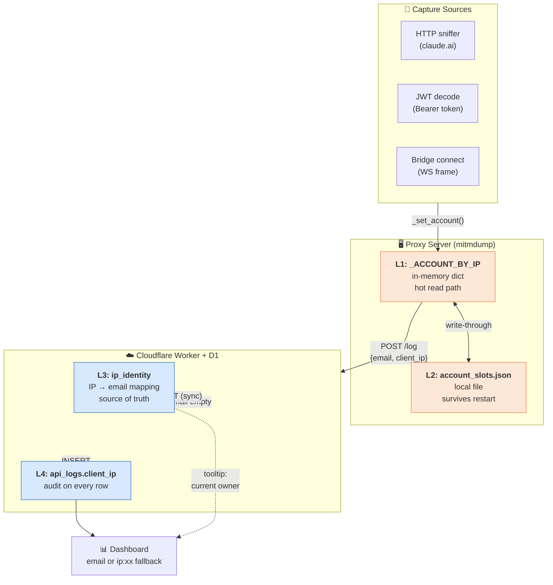
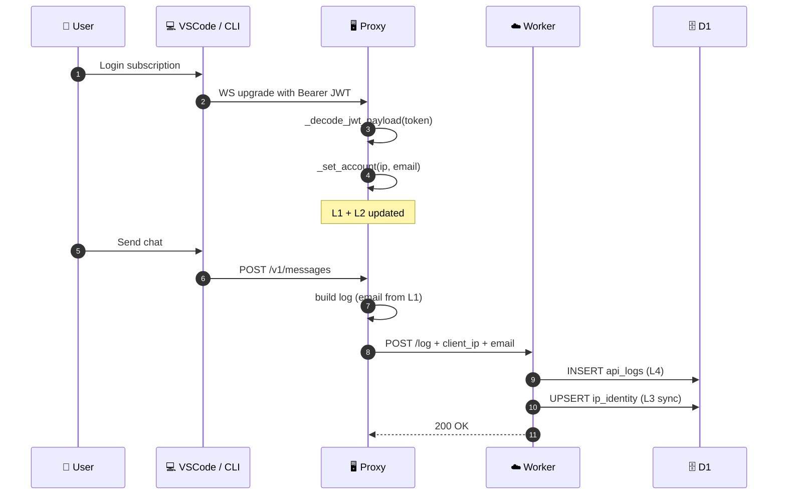
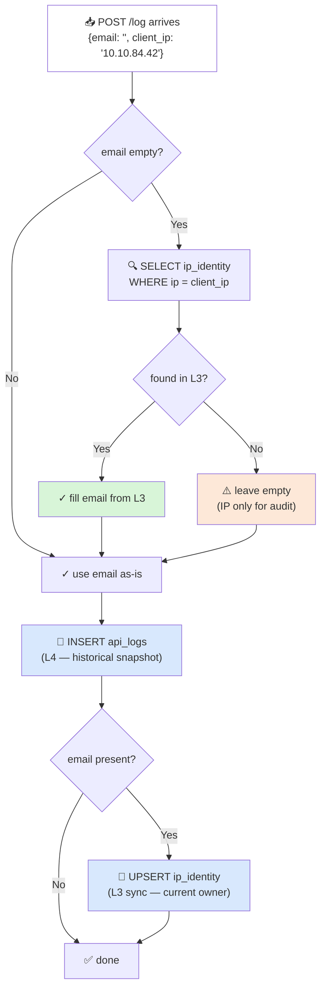
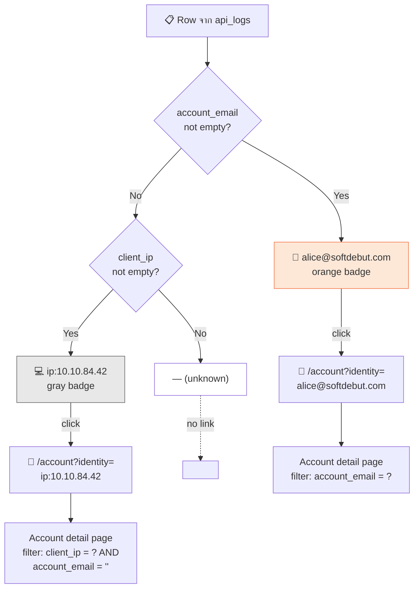

# Identity Layers — แผน implement 4 ชั้น

แผนแก้ปัญหา `account_email` empty บน shared proxy โดยกระจาย identity เก็บใน 4 ชั้น
แต่ละชั้นรอดแยกได้ — ไม่ขึ้นแก่กัน

---

> ## ⚠️ SUPERSEDED (2026-06) — เลิกใช้ IP เป็น identity แล้ว
>
> เอกสารด้านล่างคือ **ดีไซน์เดิม** ที่ใช้ **IP เป็นแกน identity** (4 ชั้น L1–L4 + ตาราง `ip_identity`
> + "ยืม email ตาม IP") — **เก็บไว้เป็นบันทึกประวัติเท่านั้น** ปัจจุบันเลิกใช้แล้วเพราะ **VPN เปลี่ยน IP
> ทำให้ attribute ผิดคน** (user A เคยใช้ IP X, วันนี้ user B ได้ IP X → log ของ B ถูกยืม email ของ A)
>
> ### โมเดลปัจจุบัน — identity = email (ไม่ใช้ IP)
> ทุก prompt มี **token ระบุตัวตนของตัวเองติดมากับ request** อยู่แล้ว → ใช้ token นั้นแทน IP:
>
> | Endpoint | Clients | ที่มาของ email |
> |---|---|---|
> | `api.anthropic.com/v1/messages` | CLI / VSCode / Desktop-Code / **Cowork** | **Bearer JWT** ของ request เอง (`_jwt_email`) |
> | `claude.ai/.../completion` | plain Desktop / web **chat** | **session cookie → email** map (`_session_key` + `ClaudeAccountSniffer`) |
>
> - device/account info (OS/arch/`account_id`/`org_id`) cache **keyed ด้วย email** (จาก metrics endpoint) — `_DEVICE_BY_EMAIL` / `_ACCOUNT_BY_EMAIL`
> - ตาราง **`ip_identity` + `lookupIdentityByIp` (L3 ยืม email ตาม IP) → ลบทิ้งแล้ว** (migration [`0011_drop_ip_identity.sql`](worker/migrations/0011_drop_ip_identity.sql))
> - **`email_identity`** (keyed ด้วย email) = canonical identity record (หน้า New Identity)
> - `client_ip` ยังเก็บใน `api_logs` แต่ **เป็น audit เท่านั้น — ไม่ใช้ระบุตัวตน**
> - **`ip_identity_backup`** = snapshot แช่แข็งของดีไซน์เดิม (ยังโชว์ที่หน้า `/identity`)
> - `ClaudeSegmentMonitor` (anonymousId ตาม IP) → **ลบออกจาก addons** (anon_id หมดความจำเป็น)
>
> โค้ดจริง: `current_email()` / `_jwt_email()` / `_session_key()` ใน [`proxy/addon.py`](proxy/addon.py)
>
> ---

## 1. ภาพรวม

### ปัญหา

- Proxy บน server กลาง — log บางส่วน `account_email = ""` (~25-64% ในบางช่วง)
- สาเหตุ: bridge subscription user ไม่ส่ง email ใน traffic / mitmdump restart ทำ slot หาย / IP ใหม่ที่ไม่เคยถูก sniff

### เป้าหมาย

1. ลด empty rate ของ subscription users < 5%
2. ทุก log ระบุที่มาได้ (อย่างน้อยรู้ IP ถึงไม่รู้ email)
3. Audit trail — รู้ว่า call ไหนมาจากเครื่องไหน
4. รอด restart proxy, worker, ทุกอย่าง

### ไม่ใช่เป้าหมาย

- API key users — fundamental ไม่มี identity ใน traffic (ออกแบบให้ระบุได้แค่ IP)
- NAT/shared IP — limitation ของ IP scoping

---

## 2. สถานะปัจจุบัน

### ที่ทำแล้ว (commits 7e5a463 + เพิ่งเสร็จ)

- ✅ **Layer 1 — `_ACCOUNT_BY_IP` dict** (in-memory, per-IP scoping)
- ✅ **Layer 2 — `log/account_slots.json`** (file persist + TTL 7 วัน)
- ✅ JWT decode จาก `Authorization` header ตอน WS upgrade
- ✅ Bridge `connect` frame email extraction (สำหรับ chrome agent — main bridge ส่วนใหญ่ไม่มี email)
- ✅ HTTP sniffer (`claude.ai` `/api/auth/current_account`, `/api/bootstrap/*`)
- ✅ Centralized `_set_account()` helper

### ยังต้องทำ

- ❌ **Layer 3** — `ip_identity` table ใน D1 (centralized + survives proxy loss)
- ❌ **Layer 4** — `api_logs.client_ip` column (audit + dashboard fallback)
- ❌ Proxy: เปลี่ยน `machine_name` จาก HOSTNAME → `client_ip`
- ❌ HTTP JWT decode ใน `ClaudeAPIMonitor` (Step 7 — confirmed ทำ)
- ❌ Dashboard — แสดง `ip:xx.xx.xx.xx` แทน `—` เมื่อ email ว่าง
- ❌ Account detail URL → `/account?identity=<email|ip:...>` (รองรับทั้ง 2 รูปแบบ + legacy `?email=`)
- ❌ Aggregate queries (By-Account chart, Accounts list) — group by composed identity

### ข้าม / Not doing

- ⏭️ Step 8 (Worker `/identity` endpoint + Proxy initial sync) — มี proxy ตัวเดียวยังไม่จำเป็น

---

## 3. Architecture — 4 Layers

### 3.1 ภาพรวม



### 3.2 Plain text (สำหรับ viewer ที่ไม่ render mermaid)

```
┌────────────────────────────────────────────────────────────────┐
│ L1: _ACCOUNT_BY_IP (in-memory)                       [Proxy]   │
│     - hot read path ตอน log                                     │
│     - update โดย sniffer / JWT / bridge connect                 │
├────────────────────────────────────────────────────────────────┤
│ L2: account_slots.json                          [Proxy disk]   │
│     - mirror ของ L1 (write-through)                             │
│     - load ตอน proxy start                                      │
├────────────────────────────────────────────────────────────────┤
│ L3: ip_identity table                          [Worker D1]    │
│     - source of truth ระยะยาว                                   │
│     - upsert ตอน worker ได้ log ที่มี email                     │
│     - lookup ตอน log มา empty                                   │
├────────────────────────────────────────────────────────────────┤
│ L4: api_logs.client_ip                         [Worker D1]    │
│     - audit field ทุก log                                       │
│     - dashboard fallback display                                │
└────────────────────────────────────────────────────────────────┘
```

### 3.3 Flow ตอน capture email



### 3.4 Flow ตอน log มี email empty



### 3.5 Display logic บน Dashboard



### 3.6 Deploy timeline

```mermaid
gantt
    title Deploy & rollout
    dateFormat X
    axisFormat %s

    section 🖥️ Proxy
    Step 1 client_ip + machine_name : 0, 1
    Step 7 HTTP JWT decode          : 4, 5

    section 🗄️ D1
    Step 2 Migration (ALTER+CREATE) : 1, 2

    section ☁️ Worker
    Step 3-5 types + handleLog logic : 2, 3
    Step 6.1-6.2 Row display         : 3, 4
    Step 6.3-6.4 Aggregate + URL     : 4, 5
    Step 6.5 Tooltip (รอ)            : 5, 6
```



### Source of truth

- L1 = ความจริงปัจจุบัน (latest sniff)
- L2 = mirror ของ L1
- L3 = mirror ของ L1 ผ่าน log POST (eventual consistency, lag ~1 call)
- L4 = immutable per row (snapshot ตอน insert)

---

## 4. ขั้นตอน implement

### Step 1 — Proxy: ส่ง `client_ip` + เปลี่ยน `machine_name` เป็น IP

**ไฟล์:** `proxy/addon.py`

3 จุดที่สร้าง log dict — แก้ field:

```python
log = {
    "id":                    str(uuid.uuid4()),
    "ts":                    ...,
    "client":                client,
    "account_email":         email,
    "client_ip":             _client_ip(flow),   # ← เพิ่ม
    "machine_name":          _client_ip(flow),   # ← เปลี่ยนจาก HOSTNAME (E.)
    ...
}
```

จุดที่ต้องใส่:
- `ClaudeAPIMonitor._log` (รับ flow มาแล้วจาก patch ก่อน) → `_client_ip(flow)`
- `ClaudeDesktopMonitor.response` (มี flow) → `_client_ip(flow)`
- `ClaudeBridgeMonitor._flush` — ไม่มี flow → ใช้ `sess["src_ip"]`

> **`HOSTNAME` global** ตอนนี้ไม่ใช้แล้ว — ลบ `HOSTNAME = socket.gethostname()` ออกได้เลย
> หรือเก็บไว้ก็ได้ (ไม่กระทบ)

> **Backwards-compatible** — ถ้า worker เวอร์ชันเก่ายังไม่รองรับ `client_ip` ก็ ignore เฉยๆ — deploy proxy ก่อนได้
> **`machine_name`** field เดิมยังอยู่ — แค่ค่าเปลี่ยนจากชื่อ server → IP ของ client

---

### Step 2 — D1 Migration

**ไฟล์:** `worker/migrations/00XX_ip_identity.sql` (ตามเลขที่ต่อจากของเดิม)

```sql
-- Audit field on api_logs
ALTER TABLE api_logs ADD COLUMN client_ip TEXT NOT NULL DEFAULT '';

-- Index for fallback grouping
CREATE INDEX IF NOT EXISTS idx_api_logs_client_ip
  ON api_logs(client_ip)
  WHERE client_ip != '';

-- Centralized IP → email mapping
CREATE TABLE IF NOT EXISTS ip_identity (
  ip          TEXT PRIMARY KEY,
  email       TEXT NOT NULL,
  name        TEXT DEFAULT '',
  uuid        TEXT DEFAULT '',
  updated_ms  INTEGER NOT NULL
);

CREATE INDEX IF NOT EXISTS idx_ip_identity_email
  ON ip_identity(email);

-- updated_ms ไม่มี cleanup job (TTL = ไม่ expire) — ไม่ต้อง index
-- แต่เก็บ column ไว้สำหรับ debug / monitoring
```

**Apply:**
```powershell
wrangler d1 execute claude-monitor --remote --file=migrations/00XX_ip_identity.sql
```

---

### Step 3 — Worker types

**ไฟล์:** `worker/src/types.ts`

```typescript
export interface ApiLog {
  // ... existing fields
  client_ip: string;     // ← เพิ่ม
}
```

---

### Step 4 — Worker `insertLog`

**ไฟล์:** `worker/src/db/queries.ts`

```typescript
export async function insertLog(env: Env, b: Partial<ApiLog>): Promise<void> {
  await env.DB.prepare(
    `INSERT OR IGNORE INTO api_logs
       (id, ts, client, account_email, client_ip, machine_name, model, prompt, ...)
     VALUES (?,?,?,?,?,?,?,?,...)`
  ).bind(
    b.id ?? crypto.randomUUID(),
    b.ts ?? Date.now(),
    b.client        ?? 'unknown',
    b.account_email ?? '',
    b.client_ip     ?? '',     // ← เพิ่ม
    b.machine_name  ?? '',
    ...
  ).run();
}
```

---

### Step 5 — Worker `handleLog` — Identity fill-in + upsert

**ไฟล์:** `worker/src/routes/log.ts`

```typescript
export async function handleLog(request: Request, env: Env): Promise<Response> {
  const provided = request.headers.get('X-Api-Key') ?? '';
  const expected = await getEffectiveIngestKey(env);
  if (!expected || provided !== expected) {
    return json({ ok: false, error: 'Unauthorized' }, 401);
  }

  try {
    const b = await request.json() as Partial<ApiLog>;
    const ip = b.client_ip ?? '';

    // Fill empty email from ip_identity (Layer 3 lookup)
    if (!b.account_email && ip) {
      const row = await env.DB.prepare(
        `SELECT email FROM ip_identity WHERE ip = ?`
      ).bind(ip).first<{ email: string }>();
      if (row?.email) {
        b.account_email = row.email;
      }
    }

    // Insert log row (Layer 4)
    await insertLog(env, b);

    // Upsert ip_identity from successful capture (Layer 3 sync)
    if (b.account_email && ip) {
      await env.DB.prepare(
        `INSERT INTO ip_identity (ip, email, updated_ms)
         VALUES (?, ?, ?)
         ON CONFLICT(ip) DO UPDATE SET
           email      = excluded.email,
           updated_ms = excluded.updated_ms`
      ).bind(ip, b.account_email, Date.now()).run();
    }

    return json({ ok: true });
  } catch (e) {
    return json({ ok: false, error: String(e) }, 400);
  }
}
```

> ⚠️ **Performance:** D1 SELECT + INSERT + UPSERT = 3 queries per log
> Scale ปัจจุบัน (~1000 calls/day) ไม่น่ามีปัญหา
> ถ้าโตถึง >10K/วัน ค่อยพิจารณา batch หรือ cache

---

### Step 6 — Dashboard: แสดง IP แทน `—` เมื่อ email ว่าง

มี 2 ระดับ — ทำตามลำดับ

#### 6.1 — Helper function

**ไฟล์:** `worker/src/lib/account.ts` (เพิ่ม)

```typescript
export function displayAccount(email: string, clientIp: string): string {
  if (email)    return email;
  if (clientIp) return `ip:${clientIp}`;
  return '—';
}

// ตรวจว่า identifier เป็น IP fallback หรือ email
export function isIpIdentity(id: string): boolean {
  return id.startsWith('ip:');
}

// ดึง IP ออกจาก "ip:10.10.84.42" → "10.10.84.42"
export function stripIpPrefix(id: string): string {
  return id.startsWith('ip:') ? id.slice(3) : id;
}
```

#### 6.2 — Row-level display (เริ่มจากนี้ — ทำได้ทันทีหลัง Step 1-5)

ใช้ helper ที่แสดง 1 row ต่อ 1 call (มี client_ip ใน row data อยู่แล้ว)

**ไฟล์ที่ต้องแก้:**

| ไฟล์ | สิ่งที่แก้ |
|---|---|
| `worker/src/lib/badge.ts:76` | `accountBadge(email, clientIp)` รับ 2 args |
| `worker/src/views/dashboard.ts:165` | recent calls table ใช้ `displayAccount(r.account_email, r.client_ip)` |
| `worker/src/views/account-detail.ts` | tab "recent calls" ของ account detail |
| `worker/src/lib/csv.ts` | export — เพิ่ม column `client_ip` แยก (ไม่ปนกับ `account_email`) |

**ตัวอย่าง badge.ts**

```typescript
export function accountBadge(email: string, clientIp = ''): string {
  const display = displayAccount(email, clientIp);
  const isIp    = isIpIdentity(display);
  const cls     = isIp ? 'chip acct ip-fallback' : 'chip acct';
  return `<span class="${cls}">${esc(display)}</span>`;
}
```

CSS แยกสีให้รู้ว่าเป็น IP fallback (เช่น gray แทน orange):
```css
.chip.acct.ip-fallback {
  background: #6b6b6b22;
  color: #6b6b6b;
  font-family: ui-monospace, monospace;
}
```

#### 6.3 — Aggregate display (ทำต่อ — query เปลี่ยน)

หน้าที่ **GROUP BY `account_email`** — ต้องเปลี่ยนเป็น compose identity

**ไฟล์ที่กระทบ:** `worker/src/db/queries.ts`

ทุกที่ที่มี `GROUP BY account_email` ให้แทนด้วย:

```sql
SELECT
  CASE WHEN account_email != ''
       THEN account_email
       ELSE 'ip:' || client_ip
  END AS identity,
  COUNT(*) AS n,
  SUM(cost_usd) AS cost
FROM api_logs
WHERE ...
GROUP BY identity
ORDER BY cost DESC
```

**Query ที่ต้องแก้:**

- `fetchDashboardData.byAccount` — bar chart "By Account"
- `fetchAccountsList` — `/accounts` page (ตอนนี้ filter `account_email != ''` — ต้องเปิดให้ empty มาได้ + group ตาม identity ใหม่)
- `fetchAccountDetail` — header summary (ถ้ามอง /account?identity=ip:... ต้อง filter ตาม identity)
- `allAccountsRes` — dropdown options ในหน้า Dashboard

**ไฟล์ที่ต้องแก้ตาม:**

| ไฟล์ | สิ่งที่แก้ |
|---|---|
| `worker/src/db/queries.ts` | aggregate queries (above) |
| `worker/src/views/accounts.ts` | list view — แสดง IP รวมกับ email |
| `worker/src/views/dashboard.ts:208,212` | dropdown filter + bar chart items |

#### 6.4 — URL ของ Account Detail (Option B)

ตอนนี้ใช้ `/account?email=alice@x.com`
เปลี่ยนรับทั้ง 2 รูปแบบผ่าน param `identity`:

```
/account?identity=alice@x.com           ← email (เดิม)
/account?identity=ip:10.10.84.42        ← IP fallback (ใหม่)
```

**Backwards-compat:** รองรับ `?email=` ต่อให้เป็น period กลางๆ — redirect ภายในเป็น `?identity=`

**ไฟล์:** `worker/src/routes/account-detail.ts`

```typescript
export async function handleAccountDetail(url: URL, env: Env, user: SessionUser): Promise<Response> {
  // รองรับทั้ง ?identity= และ ?email= (legacy)
  const identity = url.searchParams.get('identity')
                ?? url.searchParams.get('email')
                ?? '';
  if (!identity) return json({ ok: false, error: 'identity required' }, 400);

  // แยก IP vs email
  const isIp     = identity.startsWith('ip:');
  const lookupIp = isIp ? identity.slice(3) : '';
  const lookupEmail = isIp ? '' : identity;

  const data = await fetchAccountDetail(env, lookupEmail, lookupIp, ...);
  // ...
}
```

**ไฟล์:** `worker/src/db/queries.ts` — `fetchAccountDetail`

แก้ filter clause:

```typescript
// ก่อน
const conds = ['account_email = ?', 'ts >= ?', 'ts <= ?'];
const params = [email, fromMs, toMs];

// หลัง — รองรับทั้ง email และ ip
const conds  = ['ts >= ?', 'ts <= ?'];
const params: (string|number)[] = [fromMs, toMs];

if (lookupEmail) {
  conds.unshift('account_email = ?');
  params.unshift(lookupEmail);
} else if (lookupIp) {
  conds.unshift(`account_email = '' AND client_ip = ?`);
  params.unshift(lookupIp);
}
```

**Link generation:** ทุกที่ที่ลิงก์ไป `/account` ต้องใช้ `identity` แทน `email`

```typescript
// ก่อน
<a href="/account?email=${encodeURIComponent(email)}">

// หลัง
<a href="/account?identity=${encodeURIComponent(identity)}">
```

ที่ต้องแก้:
- `worker/src/views/accounts.ts` — list table link
- `worker/src/views/dashboard.ts` — by-account bar chart link
- `worker/src/lib/badge.ts` — ถ้ามี link wrap รอบ badge

#### 6.5 — Tooltip "current owner" (เลือกทำต่อ)

ตอนแสดง IP fallback → hover แสดง email ปัจจุบันของ IP (ดึงจาก `ip_identity`):

```typescript
// ใน badge หรือ row render
const currentOwner = await env.DB.prepare(
  `SELECT email FROM ip_identity WHERE ip = ?`
).bind(clientIp).first<{ email: string }>();

const title = currentOwner?.email
  ? `current owner: ${currentOwner.email}`
  : 'no email captured';
```

→ ทำให้ admin หาคนได้เร็วขึ้นแม้ historical row ติด IP

---

### Step 7 — HTTP JWT decode ✅ ทำ

**ไฟล์:** `proxy/addon.py` — เพิ่ม `request` hook ใน `ClaudeAPIMonitor`

```python
def request(self, flow: http.HTTPFlow):
    """Pull email from Bearer JWT before forwarding to api.anthropic.com."""
    if flow.request.host != "api.anthropic.com":
        return
    auth = flow.request.headers.get("Authorization", "") or \
           flow.request.headers.get("authorization", "")
    if not auth.lower().startswith("bearer "):
        return
    token = auth[7:]
    # API key (sk-ant-) is not a JWT — skip
    if token.startswith("sk-"):
        return
    payload = _decode_jwt_payload(token)
    email = payload.get("email") or payload.get("email_address") or ""
    if _looks_like_email(email):
        _set_account(
            _client_ip(flow),
            email,
            name=payload.get("name") or "",
            uuid_=str(payload.get("sub") or ""),
            source="api jwt",
        )
```

**ผลคาดหวัง:** ครอบ Claude Code VSCode/CLI ที่ login ผ่าน subscription แล้วยิง `/v1/messages` ตรงๆ (ไม่ผ่าน bridge)

---

### Step 8 — Worker `/identity` endpoint + Proxy sync ⏭️ ข้าม

> **Status:** ไม่ทำตอนนี้ (มี proxy ตัวเดียว) — เก็บ section ไว้เผื่ออนาคต scale

**Use case:** Proxy server ใหม่ที่ยังไม่มี `account_slots.json` — อยาก bootstrap จาก D1

**Worker:** `worker/src/routes/identity.ts`
```typescript
export async function handleIdentity(request: Request, env: Env) {
  // ตรวจ X-Api-Key เหมือน /log
  const rows = await env.DB.prepare(
    `SELECT ip, email, name, uuid, updated_ms FROM ip_identity
     WHERE updated_ms > ?`
  ).bind(Date.now() - 7 * 24 * 60 * 60 * 1000).all();
  return json({ identities: rows.results });
}
```

**Proxy:** เพิ่มใน `addon.py` ตอน module load (หลัง `_ACCOUNT_BY_IP.update(_load_slots())`)

```python
def _sync_from_worker():
    try:
        req = urllib.request.Request(
            f"{WORKER_URL}/identity",
            headers={"X-Api-Key": API_KEY}
        )
        resp = _no_proxy_opener.open(req, timeout=10)
        data = json.loads(resp.read())
        for r in data.get("identities", []):
            ip = r.get("ip")
            if ip and ip not in _ACCOUNT_BY_IP:
                _ACCOUNT_BY_IP[ip] = {
                    "email":      r["email"],
                    "name":       r.get("name", ""),
                    "uuid":       r.get("uuid", ""),
                    "updated_ms": r["updated_ms"],
                }
        _save_slots()
        print(f"[claude-monitor] synced {len(data.get('identities', []))} from worker")
    except Exception as e:
        print(f"[claude-monitor] worker sync skipped: {type(e).__name__}: {e}")

_sync_from_worker()
```

> **ระวัง:** อย่า overwrite L1 ที่ใหม่กว่า — เช็ค `updated_ms` ก่อน merge

---

## 5. Deploy Order

แต่ละ step deploy แยกได้ — ของเดิมไม่พัง

```
Step 1: Proxy ใส่ client_ip                  [Proxy restart]
        ↓
        Worker ignore field ใหม่ — ของเดิมยังทำงาน

Step 2: D1 migration (ALTER + CREATE)        [Worker no restart needed]
        ↓
        api_logs มี column client_ip แต่ ค่า "" (default)

Step 3-5: Worker types + insertLog + handleLog logic   [Worker deploy]
        ↓
        เริ่มเก็บ client_ip จริง + lookup ip_identity + upsert

Step 6.1+6.2: Helper + row-level display     [Worker deploy]
              ↓
              recent calls table แสดง ip:... แทน —

Step 6.3+6.4: Aggregate queries + URL identity param   [Worker deploy]
              ↓
              By-Account chart, Accounts list, /account?identity=
              รองรับ ?email= (legacy) → redirect

Step 6.5: (รอ) tooltip current owner          [Worker deploy]
          ↓
          หลัง 6.1-6.4 เสร็จค่อยพิจารณา

Step 7: HTTP JWT decode                       [Proxy restart]
        ↓
        ครอบ VSCode/CLI subscription ที่ใช้ HTTP

Step 8: ⏭️ ข้าม — /identity sync             [ไม่ทำตอนนี้]
```

---

## 6. ทดสอบ

### Smoke test หลัง Step 1-5

1. ดู log ใน D1 — `client_ip` ต้องมีค่า ไม่ว่าง
```sql
SELECT account_email, client_ip, COUNT(*)
FROM api_logs
WHERE ts > <recent_ts>
GROUP BY 1, 2;
```

2. ตรวจ `ip_identity` มี mapping
```sql
SELECT * FROM ip_identity ORDER BY updated_ms DESC LIMIT 10;
```

3. **Empty fill-in test:**
   - Manual INSERT ตาราง `ip_identity` ค่าสมมุติ
   - POST log ด้วย account_email ว่าง + client_ip ตรงกัน
   - ดู api_logs row ที่เกิด — `account_email` ต้องถูก fill

### Empty rate comparison

ก่อน-หลัง deploy เทียบจาก `claude_YYYY-MM-DD.jsonl`:
```python
# expected: empty rate ลดลงในกลุ่ม subscription users
```

### Edge cases

- Proxy restart → ดู `account_slots.json` ถูก load
- Worker offline → proxy ยังส่ง log ไม่ block (fire-and-forget)
- Account switch → log row ใหม่ติด email ใหม่, row เก่าไม่ถูก update, `ip_identity` update

---

## 7. Rollback

แต่ละ layer ลบได้แยก:

| ถ้าจะ rollback... | ต้องทำ |
|---|---|
| **Step 7 HTTP JWT** | ลบ `request` method จาก ClaudeAPIMonitor |
| **Step 6 Dashboard** | revert view files |
| **Step 5 Worker logic** | revert `handleLog` → ใช้แค่ insertLog |
| **Step 3-4 schema** | column + table ปล่อยไว้ก็ได้ ไม่กระทบ |
| **Step 2 D1** | `DROP TABLE ip_identity; ALTER TABLE api_logs DROP COLUMN client_ip;` — แต่ DROP COLUMN ใน SQLite ไม่ตรงไปตรงมา — ปล่อยไว้ดีกว่า |
| **Step 1 Proxy** | revert addon.py |

---

## 8. ตัดสินใจแล้วทั้งหมด

| เรื่อง | เลือก |
|---|---|
| **URL ของ Account detail** | **Option B** — `/account?identity=<value>` รองรับทั้ง `email` และ `ip:xx.xx.xx.xx`<br>เก็บ backwards-compat กับ `?email=` (legacy redirect ภายใน) |
| **Empty display** | แสดง IP แทน `—` ใช้ format `ip:10.10.84.42` |
| **A. TTL ของ `ip_identity`** | **ไม่ expire** — เก็บถาวร ไม่มี cleanup job<br>หมายเหตุ: DHCP churn จะถูก overwrite ตอน sniff/JWT capture ใหม่จาก IP เดียวกัน |
| **B. IP display style** | **plain** `ip:10.10.84.42` — ไม่ทำ reverse DNS / static map |
| **C. Privacy — เก็บ IP ใน DB** | **Raw** — เก็บ IP ตรงๆ (internal company use) ไม่ hash/mask |
| **D. Optional steps** | **ทำ Step 7** (HTTP JWT decode)<br>**ข้าม Step 8** (worker sync — มี proxy เดียว ไม่จำเป็น)<br>**รอ Step 6.5** (tooltip — หลัง 6.1-6.4 เสร็จ) |
| **E. machine_name** | **เอา `client_ip` ใส่** — เปลี่ยน `HOSTNAME` (ชื่อ server) → `_client_ip(flow)` ใน 3 monitor classes |

### E. machine_name
- ตอนนี้เป็นชื่อ server (`"dify"`) — แก้ไปด้วยเลยไหม?
- ตัวเลือก: เอา `client_ip` มาแทน / reverse DNS lookup / drop field

---

## 9. สรุป

**Estimated effort:** ~70 บรรทัด code + ~10 บรรทัด SQL + Dashboard view updates

**Expected outcome:**
- Empty rate ใน subscription users: 25-64% → < 5%
- Audit coverage: 0% → 100% (ทุก log มี client_ip)
- Resilience: proxy restart / worker restart / proxy ใหม่ — ทุกกรณีรอด

**Limitations ที่ยังเหลือ:**
- API key users — ไม่มี email ใน traffic (ต้องใช้ fingerprint เสริม ถ้าจำเป็น)
- First call ของ IP ใหม่ — ต้องรอ sniff/JWT ก่อน 1 call
- NAT/shared IP — fundamental ของ IP scoping
