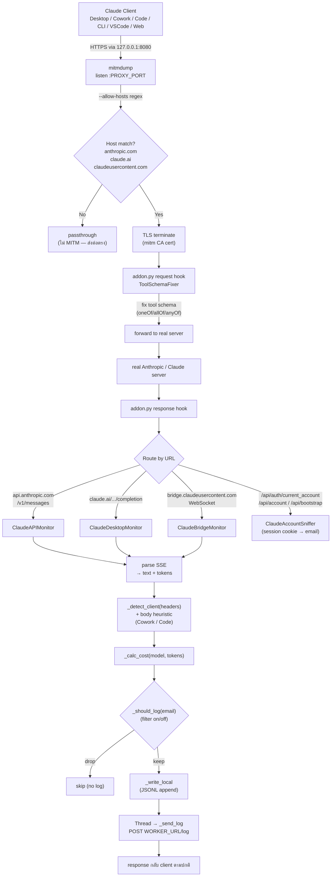

# Proxy Guide — คู่มือฉบับละเอียดของฝั่ง Proxy

คู่มือนี้อธิบาย **เฉพาะ** ส่วน `proxy/` ของ claude-monitor — ตั้งแต่หลักการทำงาน ขั้นตอน install ทั้งฝั่ง server และฝั่ง client จนถึงผลลัพธ์ที่ได้ พร้อม demo จาก log จริง

> สำหรับ Worker / D1 / Dashboard ดูที่ [../README.md](../README.md) และ [../SETUP.md](../SETUP.md)
> สำหรับ developer internals ดูที่ [../DEVELOPER.md](../DEVELOPER.md)

---

## สารบัญ

1. [ระบบนี้คืออะไร](#1-ระบบนี้คืออะไร)
   - [1.1 ใช้กับ platform ไหนได้บ้าง](#11-ใช้กับ-platform-ไหนได้บ้าง)
2. [Tools ที่ใช้](#2-tools-ที่ใช้)
3. [Flow การทำงาน](#3-flow-การทำงาน)
4. [Setting Server](#4-setting-server)
5. [Setting Client](#5-setting-client)
6. [Result](#6-result)
   - [6.6 จุดที่ "ยิง API" ไปเก็บ log ที่ Worker](#66-จุดที่-ยิง-api-ไปเก็บ-log-ที่-worker-code-map)
7. [Demo](#7-demo)

---

## 1. ระบบนี้คืออะไร

**Claude Monitor Proxy** คือ **MITM (Man-In-The-Middle) proxy** ที่นั่งคั่นระหว่าง Claude clients กับ server ของ Anthropic/Claude.ai เพื่อ **ดักจับ HTTPS traffic ทุก call** แล้วบันทึก prompt / response / token usage / cost — ทั้ง local (JSONL) และส่งขึ้น Cloudflare Worker ไปลง D1 + Dashboard

**ปัญหาที่แก้:**

Claude ในยุคปัจจุบันมีหลาย channel ที่แต่ละช่องใช้ endpoint คนละแบบ:

| Client | Endpoint |
|---|---|
| Claude Code CLI (API key) | `api.anthropic.com/v1/messages` |
| Claude Code CLI (OAuth) | `bridge.claudeusercontent.com` WebSocket |
| Claude Code VSCode | `api.anthropic.com/v1/messages` |
| Claude Desktop — Chat | `claude.ai/.../chat_conversations/.../completion` |
| Claude Desktop — Cowork | `api.anthropic.com/v1/messages?beta=true` |
| Claude Desktop — Code tab | `api.anthropic.com/v1/messages?beta=true` |
| claude.ai web | เหมือน Desktop Chat |
| Claude API SDK ใดก็ตาม | `api.anthropic.com/v1/messages` |

ถ้าอยาก **ตามทุก call จากทุก channel ในที่เดียว** — ทำ MITM ที่ TLS layer คือทางที่ครอบคลุมที่สุด เพราะทุก channel ในตารางนี้วิ่งผ่าน HTTPS

**ทำไม MITM proxy ดีกว่าทางอื่น:**

- **Anthropic console** ตามได้แค่ API key ของตัวเอง — ไม่เห็น Desktop / Cowork / claude.ai web
- **SDK middleware** ครอบคลุมแค่ที่ใช้ SDK — ไม่ครอบคลุม Desktop / web / CLI
- **MITM proxy** เห็นทุก client บนเครื่องเดียวกัน ตราบใดที่ point HTTPS_PROXY มาที่ proxy

### 1.1 ใช้กับ platform ไหนได้บ้าง

| Platform | สถานะ | หมายเหตุ |
|---|---|---|
| **Windows 10/11** | ✅ Primary support | scripts ทุกตัวใน `proxy/` เป็น `.ps1` |
| **macOS** | ⚠️ ใช้ได้ ตั้งเอง | ตั้ง env ใน `~/.zshrc` / `~/.bashrc` + trust CA ผ่าน Keychain |
| **Linux** | ⚠️ ใช้ได้ ตั้งเอง | ตั้ง env shell + `update-ca-certificates` |
| **Mobile (iOS/Android)** | ❌ ไม่ครอบคลุม | คนละเครื่อง — ต้อง MITM ที่ router |
| **HTTP/3 (QUIC)** | ⚠️ ระวังในอนาคต | mitmproxy ดักได้แค่ TCP — ปัจจุบัน Claude ยังใช้ TCP เป็นหลัก |

**Claude clients ที่ตอนนี้ทดสอบแล้วใช้ได้:**

- ✅ Claude Code CLI (API key + OAuth)
- ✅ Claude Code VSCode extension
- ✅ Claude Desktop — Chat / Cowork / Code tab ทั้งหมด
- ✅ claude.ai web (ผ่าน browser ที่ตั้ง proxy)
- ✅ Claude API SDK ใดก็ได้ (Python / TS / Go)
- ✅ Chrome Extension ที่วิ่งผ่าน `bridge.claudeusercontent.com`

---

## 2. Tools ที่ใช้

| Tool | Version | บทบาท |
|---|---|---|
| **[mitmproxy](https://mitmproxy.org/)** (`mitmdump`) | ≥10.0.0 | TLS MITM proxy + addon framework — หัวใจของ proxy ทั้งหมด |
| **Python** | ≥3.9 | รัน mitmdump + addon code |
| **PowerShell** | ≥5 | install / start / env-setup scripts (Windows) |
| **mitmproxy CA cert** | self-signed | root cert สำหรับ TLS termination — ต้อง trust ในเครื่อง |
| **`urllib` (Python stdlib)** | — | POST log → Worker (bypass system proxy เพื่อกัน loopback) |

ไฟล์ที่เกี่ยวข้อง (อ้างอิงในคู่มือนี้):

- [proxy/addon.py](addon.py) — mitmproxy addon หลัก
- [proxy/config.example.py](config.example.py) — template ของ config
- [proxy/start.ps1](start.ps1) — start mitmdump
- [proxy/install-cert.ps1](install-cert.ps1) — trust CA cert
- [proxy/install-claude-proxy.ps1](install-claude-proxy.ps1) — one-shot client setup
- [proxy/requirements.txt](requirements.txt) — `mitmproxy>=10.0.0`

---

## 3. Flow การทำงาน

### Flowchart



### Step-by-step

1. **Client → Proxy**
   Client ที่ตั้ง `HTTPS_PROXY=http://127.0.0.1:8080` จะส่งทุก HTTPS request ผ่าน `mitmdump` ก่อน

2. **Host filter ที่ mitmdump**
   `start.ps1` เรียก mitmdump ด้วย `--allow-hosts "(anthropic\.com|claude\.ai|claudeusercontent\.com)"` — host อื่นทั้งหมด **pass-through** โดยไม่ MITM (ไม่กระทบ Slack / GitHub / npm registry ฯลฯ)

3. **TLS termination**
   เฉพาะ host ที่ match — mitm ใช้ self-signed CA cert (`~/.mitmproxy/mitmproxy-ca-cert.pem`) ออก leaf cert ใหม่ตามชื่อ SNI ที่ขอ → client trust ได้เพราะ CA อยู่ใน Trusted Root

4. **Request hook — `ToolSchemaFixer`** (สำคัญ)
   ก่อน forward ไป Anthropic — hook นี้ scan `tools[]` ใน body แล้วถ้า `input_schema` มี `oneOf` / `allOf` / `anyOf` ที่ root **flatten** เป็น `{"type":"object","additionalProperties":true}` ก่อน
   **เหตุผล:** Anthropic API จะ reject schema แบบนี้ด้วย error `tools.N.custom.input_schema: input_schema does not support oneOf, allOf, or anyOf at the top level` — บาง MCP connector (Notion, Drive, Taskrabbit, ...) ส่ง schema แบบนี้มา ทำให้ request 400 ทั้งหมด — proxy รับซ่อมให้ก่อนส่งต่อ

5. **Forward → real server → response**
   mitmproxy ยิงต่อไป Anthropic จริงๆ ได้ SSE stream กลับมา

6. **Response hook — route ไป Monitor class**
   addon.py มี monitor class แต่ละตัวรับผิดชอบ endpoint เดียว:

   | Class | Endpoint | Client tag ที่ส่ง |
   |---|---|---|
   | `ClaudeAPIMonitor` | `api.anthropic.com/v1/messages` (รวม `?beta=true`) | `claude-code-cli` / `claude-code-vscode` / `claude-desktop-code` / `claude-desktop-cowork` / `api` |
   | `ClaudeDesktopMonitor` | `claude.ai/.../chat_conversations/.../completion` | `claude-desktop` |
   | `ClaudeBridgeMonitor` | `bridge.claudeusercontent.com` WS | `claude-code-cli` / `claude-code-vscode` / `browser-extension` |
   | `ClaudeAccountSniffer` | `/api/auth/current_account`, `/api/account`, `/api/bootstrap/...` (whitelist) | — (map **session cookie → email** สำหรับ claude.ai chat) |

   > **🔑 Identity model (อัปเดต 2026-06):** ระบุตัวตนด้วย **email ไม่ใช่ IP** (VPN-safe) — `/v1/messages`
   > (CLI/VSCode/Desktop-Code/Cowork) ดึง email จาก **Bearer JWT** ของ request เอง; `claude.ai` chat ดึงจาก
   > **session cookie → email** map ที่ `ClaudeAccountSniffer` เก็บไว้ · `client_ip` เก็บเป็น **audit เท่านั้น**
   > · ดีไซน์เดิม (IP 4 ชั้น — เลิกใช้แล้ว) ที่ [../IDENTITY-LAYERS-PLAN.md](../IDENTITY-LAYERS-PLAN.md)

7. **Parse + classify + price**
   - Parse SSE stream → ข้อความ response + token counts (input/output/cache_create/cache_read)
   - `_detect_client(headers)` ดู `user-agent` / `anthropic-client-name` / `x-app` / `x-client-context` เพื่อแยก client
   - **Body heuristic:** ถ้า body มี `mcp__cowork__*` → override เป็น `claude-desktop-cowork` ถ้ามี Code tools (Bash/Read/Write/...) + header detect ไม่ได้ → fallback `claude-code-cli`
   - `_calc_cost(model, tokens)` — คิด USD ตาม tier (Opus / Sonnet / Haiku)

8. **Filter + persist**
   - `_should_log(email)` — ถ้าเปิด `EMAIL_FILTER_ENABLED` จะ drop call ที่ email ไม่ match `EMAIL_FILTER_SUBSTRING`
   - `_write_local(payload)` — append JSON 1 บรรทัดลง `log/claude_YYYY-MM-DD.jsonl` (sync)
   - `threading.Thread(_send_log, payload)` — POST ไป Worker ใน thread แยก fire-and-forget ถ้า Worker ล่มจะไม่กระทบ proxy

9. **Response กลับไปที่ client**
   Client ไม่รู้สึกว่าถูก intercept — เห็น response เหมือนต่อตรงไป Anthropic

### Discovery / debug helpers (ทำงานคู่กัน)

| Class | หน้าที่ | Output |
|---|---|---|
| `ClaudeConnectionLogger` | log SNI ของทุก TLS handshake (รวม passthrough) | `log/claude_connections.jsonl` |
| `ClaudeDesktopDiscovery` | log POST บน claude.ai/anthropic ที่ยังไม่มี matcher | `log/claude_desktop_discovery.jsonl` |
| `ClaudeBridgeDiscovery` | log WebSocket frame ที่ยังไม่รู้จัก | `log/claude_bridge_discovery.jsonl` |

ใช้ค้น endpoint ใหม่เวลาเจอ traffic ที่ proxy ยังไม่ครอบคลุม

---

## 4. Setting Server

ฝั่งเครื่องที่รัน proxy (ปกติคือเครื่องเดียวกับที่ใช้ Claude client)

### Prerequisites

- Windows 10/11 (scripts เป็น `.ps1`)
- Python ≥ 3.9 + pip
- PowerShell ≥ 5
- สิทธิ์ Administrator (ตอนลง CA cert)
- Cloudflare Worker URL + API key ที่ deploy แล้ว (ดู [../SETUP.md ขั้นตอนที่ 1](../SETUP.md))

### ขั้นตอน

#### 4.1 ติดตั้ง mitmproxy

```powershell
pip install -r proxy\requirements.txt
mitmdump --version    # ควรขึ้นเวอร์ชัน
```

ถ้า `mitmdump not found` — Python Scripts directory ไม่อยู่ใน PATH:

```powershell
$scripts = "$env:USERPROFILE\AppData\Local\Programs\Python\Python312\Scripts"
$env:PATH += ";$scripts"
[Environment]::SetEnvironmentVariable("PATH", "$env:PATH", "User")
```

#### 4.2 สร้าง CA cert (ครั้งแรกเท่านั้น)

```powershell
mitmdump --listen-port 8080
# รอเห็น "Proxy server listening at *:8080" → Ctrl+C
```

ตรวจ:

```powershell
Test-Path "$env:USERPROFILE\.mitmproxy\mitmproxy-ca-cert.pem"
# True
```

#### 4.3 Trust CA cert (Run as Administrator)

```powershell
proxy\install-cert.ps1
```

หรือทำด้วยมือ:

```powershell
Import-Certificate `
  -FilePath "$env:USERPROFILE\.mitmproxy\mitmproxy-ca-cert.pem" `
  -CertStoreLocation Cert:\CurrentUser\Root
```

ตรวจ:

```powershell
Get-ChildItem Cert:\CurrentUser\Root\* | Where-Object Subject -like "*mitmproxy*"
```

#### 4.4 ตั้ง `config.py`

```powershell
cd proxy
Copy-Item config.example.py config.py
notepad config.py
```

เนื้อใน:

```python
WORKER_URL = "https://claude-monitor-xxx.<yourname>.workers.dev"
API_KEY    = "<key เดียวกับที่ตั้งใน `wrangler secret put API_KEY`>"
PROXY_PORT = 8080
```

> ⚠️ `config.py` อยู่ใน `.gitignore` — อย่า commit secret

#### 4.5 (Optional) เปิด email filter

แก้ที่ [proxy/addon.py](addon.py) ราวบรรทัด 38:

```python
EMAIL_FILTER_ENABLED   = True               # True = log เฉพาะที่ match
EMAIL_FILTER_SUBSTRING = "@yourcompany"     # case-insensitive substring
```

เมื่อเปิด — call ที่ไม่มี `account_email` (raw API key) → drop, call ที่ email ไม่มี substring → drop

#### 4.6 เริ่ม proxy

```powershell
proxy\start.ps1
```

`start.ps1` รัน:

```
mitmdump -s addon.py --listen-port <PROXY_PORT> -q --allow-hosts "(anthropic\.com|claude\.ai|claudeusercontent\.com)"
```

ปล่อยรันค้างไว้ — ทุกครั้งที่ใช้ Claude tools ต้องมี proxy รันอยู่ (ไม่งั้น request จะ `ECONNREFUSED`)

### Verification checklist (Server side)

- [ ] `mitmdump --version` → ขึ้นเวอร์ชัน ≥ 10
- [ ] `Test-Path "$env:USERPROFILE\.mitmproxy\mitmproxy-ca-cert.pem"` → True
- [ ] `Get-ChildItem Cert:\CurrentUser\Root\* | ? Subject -like "*mitmproxy*"` → เจอ
- [ ] `proxy\config.py` มี `WORKER_URL` + `API_KEY` ถูกต้อง
- [ ] `proxy\start.ps1` รันได้ — ขึ้น banner `Proxy : http://127.0.0.1:8080`

---

## 5. Setting Client

ฝั่ง Claude clients (Desktop / CLI / VSCode / API SDK ฯลฯ) — ต้องให้แต่ละตัวรู้ว่า:

1. **ส่งทุก HTTPS request ผ่าน proxy** (env `HTTPS_PROXY`)
2. **trust CA cert ของ mitmproxy** (env `NODE_EXTRA_CA_CERTS` / `REQUESTS_CA_BUNDLE` / `SSL_CERT_FILE`)

### 5.1 One-shot setup (แนะนำ)

```powershell
proxy\install-claude-proxy.ps1
```

Script เดียวตั้งให้ครบ:

1. **`~/.claude/settings.json`** มี env block:
   ```json
   {
     "env": {
       "HTTPS_PROXY": "http://127.0.0.1:8080",
       "HTTP_PROXY":  "http://127.0.0.1:8080",
       "NODE_EXTRA_CA_CERTS": "C:\\Users\\<you>\\.mitmproxy\\mitmproxy-ca-cert.pem"
     }
   }
   ```
   → Claude Code CLI / VSCode pick up อัตโนมัติ

2. **User-level persistent env vars** (`setx` equivalent):
   - `HTTPS_PROXY`, `HTTP_PROXY` → `http://127.0.0.1:8080`
   - `NODE_EXTRA_CA_CERTS`, `REQUESTS_CA_BUNDLE`, `SSL_CERT_FILE` → path CA cert
   → process ทุกตัวที่ launch จาก Start menu inherit ทันที (รวม Claude Desktop + Cowork worker subprocess)

> ⚠️ **หมายเหตุสำคัญ:** ในไฟล์ [install-claude-proxy.ps1:17](install-claude-proxy.ps1#L17) ตอนนี้ `$proxyUrl` อาจถูก hardcode เป็น URL อื่น (เช่น `http://10.10.84.1:8081` สำหรับใช้บน LAN) — **ก่อนรัน ให้แก้ค่าให้ตรงกับ `PROXY_PORT` ใน `config.py`** ปกติคือ `http://127.0.0.1:8080`

### 5.2 ทำไมต้อง User-level env (ไม่ใช่แค่ session)?

Cowork ใน Claude Desktop spawn **worker subprocess** ที่ inherit env ของ Claude Desktop process — ซึ่ง Desktop ถูก launch จาก Start menu (ใช้ User-level env เท่านั้น)

- ถ้าตั้งแค่ session (`$env:HTTPS_PROXY = ...`) → มีผลแค่ shell ปัจจุบัน — Cowork bypass ทันที (ส่งตรงไป `160.79.104.x` ไม่เห็นใน proxy)
- ถ้าตั้ง User-level → Desktop process inherit → worker subprocess inherit ต่อ ครบ chain

### 5.3 ปิด-เปิด client ใหม่ (ขั้นตอนสำคัญที่สุด)

Process ที่เปิดอยู่ก่อนตั้ง env **ไม่ inherit** ค่าใหม่ ต้อง kill ทั้งหมดแล้วเปิดใหม่:

```powershell
taskkill /F /IM Code.exe
taskkill /F /IM claude.exe
taskkill /F /IM Claude.exe
```

> Claude Desktop: ปิดจาก **system tray → Quit** (ไม่ใช่แค่ปิดหน้าต่าง) ไม่งั้น background process ยังเดิม

จากนั้นเปิดทุกอย่างใหม่จาก Start menu / desktop shortcut — env vars ที่เป็น User-level จะ inherit อัตโนมัติ

### 5.4 ทางเลือกอื่น

| Script | Scope | เมื่อใช้ |
|---|---|---|
| `enable-proxy.ps1` | session-only (dot-source) | ทดสอบ shell เดียว ไม่อยากกระทบเครื่อง |
| `install-proxy-env.ps1` | User-level (ไม่แตะ `settings.json`) | ใช้แค่ CLI/VSCode ไม่ใช้ Desktop |
| **`install-claude-proxy.ps1`** ⭐ | User-level + `~/.claude/settings.json` | ครอบคลุมทุก client — **แนะนำ** |

### 5.5 macOS / Linux

ตั้งใน `~/.zshrc` หรือ `~/.bashrc`:

```bash
export HTTPS_PROXY=http://127.0.0.1:8080
export HTTP_PROXY=http://127.0.0.1:8080
export NODE_EXTRA_CA_CERTS=$HOME/.mitmproxy/mitmproxy-ca-cert.pem
export REQUESTS_CA_BUNDLE=$HOME/.mitmproxy/mitmproxy-ca-cert.pem
export SSL_CERT_FILE=$HOME/.mitmproxy/mitmproxy-ca-cert.pem
```

Trust CA:

- **macOS:** `sudo security add-trusted-cert -d -r trustRoot -k /Library/Keychains/System.keychain ~/.mitmproxy/mitmproxy-ca-cert.pem`
- **Linux:** `sudo cp ~/.mitmproxy/mitmproxy-ca-cert.pem /usr/local/share/ca-certificates/ && sudo update-ca-certificates`

### Verification checklist (Client side)

```powershell
# 1. env vars ต้องไม่ว่าง
[Environment]::GetEnvironmentVariable('HTTPS_PROXY','User')         # http://127.0.0.1:8080
[Environment]::GetEnvironmentVariable('NODE_EXTRA_CA_CERTS','User') # path .pem

# 2. settings.json ต้องมี env block
Test-Path "$env:USERPROFILE\.claude\settings.json"                  # True

# 3. ใน shell ใหม่ — env ต้อง inherit
$env:HTTPS_PROXY        # http://127.0.0.1:8080
$env:NODE_EXTRA_CA_CERTS # path .pem

# 4. process ใช้ proxy จริงไหม
Get-NetTCPConnection -State Established |
  Where-Object { $_.OwningProcess -in (Get-Process Code).Id } |
  Where-Object RemotePort -eq 8080
```

---

## 6. Result

### 6.1 ไฟล์ที่ proxy สร้าง

ทั้งหมดอยู่ใน `log/` (relative กับ repo root):

| ไฟล์ | เนื้อหา | ความถี่ |
|---|---|---|
| `claude_YYYY-MM-DD.jsonl` | **Log หลัก** — 1 บรรทัด = 1 call (prompt + response + tokens + cost) | ต่อ call |
| `claude_connections.jsonl` | SNI hostname ของทุก TLS handshake | ต่อ connection |
| `claude_desktop_discovery.jsonl` | POST endpoint บน claude.ai/anthropic ที่ยังไม่มี matcher | เมื่อเจอ endpoint ใหม่ |
| `claude_bridge_discovery.jsonl` | WebSocket frame ของ bridge ที่ยังไม่รู้จัก | เมื่อเจอ frame ใหม่ |
| `schema_fixes.jsonl` | tool ที่ `ToolSchemaFixer` rewrite | เมื่อ trigger schema fix |

ทั้งหมด append-only — ลบเองได้ตลอด ไม่กระทบ proxy ที่กำลังรัน

### 6.2 Schema ของ entry (`claude_YYYY-MM-DD.jsonl`)

```json
{
  "id": "uuid",
  "ts": 1778477666756,
  "client": "claude-code-vscode",
  "account_email": "",
  "machine_name": "Thanakrit",
  "model": "claude-sonnet-4-6",
  "prompt": "ข้อความที่ user พิมพ์จริง (ข้าม system-reminder)",
  "prompt_chars": 56,
  "response_chars": 362,
  "input_tokens": 3,
  "output_tokens": 472,
  "cache_creation_tokens": 533,
  "cache_read_tokens": 44276,
  "total_tokens": 45284,
  "cost_usd": 0.02237055
}
```

ความหมาย field สำคัญ:

| Field | คำอธิบาย |
|---|---|
| `client` | จาก `_detect_client` + body heuristic — ดู mapping ใน section 3 step 6 |
| `account_email` | **identity หลัก (email)** — `/v1/messages` ดึงจาก Bearer JWT ของ request; `claude.ai` chat ดึงจาก session cookie (ผ่าน `ClaudeAccountSniffer`); จับไม่ได้ → ว่าง (โดน email filter drop) |
| `client_ip` | IP ของ client — **audit เท่านั้น ไม่ใช้ระบุตัวตน** (VPN เปลี่ยน IP ได้) |
| `prompt` | prompt user **จริง** — `_extract_prompt_*` ข้าม `<system-reminder>` blocks และ system prompt |
| `cache_creation_tokens` / `cache_read_tokens` | Anthropic prompt caching — read ถูกกว่า write 12.5 เท่า |
| `cost_usd` | คำนวณตาม tier (Opus / Sonnet / Haiku) — ดู pricing table ด้านล่าง |

### 6.3 Console output ขณะรัน

```
[claude-monitor] email filter ON — only logging accounts containing '@softdebut'
[claude-conn] SNI seen: claude.ai
[claude-conn] SNI seen: api.anthropic.com
[claude-account] ✓ detected email: user@softdebut.com (from /api/auth/current_account)
[claude-api] claude-code-vscode | claude-sonnet-4-6 | in=3 out=472 | $0.02237
[claude-desktop] claude-sonnet-4-6 | prompt=145ch | in=1567 out=789 | $0.00234
```

หนึ่งบรรทัดต่อ event — ดู real-time ขณะ debug

### 6.4 Pricing table (USD / 1M tokens)

จาก [proxy/addon.py](addon.py) `_PRICE`:

| Tier | Input | Output | Cache Read | Cache Write |
|---|---|---|---|---|
| Opus | $15 | $75 | $1.50 | $18.75 |
| Sonnet | $3 | $15 | $0.30 | $3.75 |
| Haiku | $0.80 | $4 | $0.08 | $1.00 |

`_calc_cost` map ชื่อ model → tier:
- `"opus"` ในชื่อ → Opus
- `"haiku"` ในชื่อ → Haiku
- อื่นๆ (รวม `sonnet`) → Sonnet (default)

### 6.5 Worker upload (downstream)

ทุก call ที่ผ่าน `_should_log` จะถูก:

1. เขียน local JSONL (sync — ทุก call ต้องลงให้ได้)
2. POST `{WORKER_URL}/log` พร้อม header `X-Api-Key: {API_KEY}` ใน thread แยก (fire-and-forget)

ถ้า Worker ล่ม / network หลุด → proxy ยังบันทึก local ปกติ ไม่ block client

### 6.6 จุดที่ "ยิง API" ไปเก็บ log ที่ Worker (code map)

หัวใจของการส่ง log ขึ้น Worker คือฟังก์ชัน `_send_log` ใน [proxy/addon.py](addon.py) — เปิด socket ตัวเองที่ **bypass system proxy** (เพื่อกัน loopback กลับเข้า mitmproxy เอง) แล้ว POST JSON เข้า `{WORKER_URL}/log`

**ฟังก์ชัน `_send_log`** — [proxy/addon.py:320-342](addon.py#L320-L342)

```python
# Build ONE opener that bypasses system proxy (avoid loopback through mitmproxy)
_no_proxy_opener = urllib.request.build_opener(urllib.request.ProxyHandler({}))

def _send_log(payload: dict):
    """Send log to Cloudflare Worker — bypasses system proxy to avoid loopback."""
    try:
        body = json.dumps(payload).encode()
        req  = urllib.request.Request(f"{WORKER_URL}/log", data=body, method="POST")
        req.add_header("Content-Type", "application/json")
        req.add_header("X-Api-Key",    API_KEY)
        req.add_header("User-Agent",   "Mozilla/5.0 (claude-monitor mitmproxy addon)")
        resp = _no_proxy_opener.open(req, timeout=8)
        status = resp.getcode()
        if status != 200:
            print(f"[claude-monitor] WARN worker returned {status}")
    except Exception as e:
        print(f"[claude-monitor] ERROR sending to worker: {type(e).__name__}: {e}")
```

จุดสำคัญในฟังก์ชัน:

| Line | สิ่งที่ทำ | เหตุผล |
|---|---|---|
| `_no_proxy_opener = ...ProxyHandler({})` | สร้าง opener ที่ ignore `HTTPS_PROXY` env | ถ้าใช้ default urllib → request จะวิ่งกลับเข้า mitmproxy เอง (loopback infinite) |
| `f"{WORKER_URL}/log"` | endpoint ที่ Worker รับ | match กับ Worker route [worker/src/index.ts:256](../worker/src/index.ts#L256) |
| `X-Api-Key: {API_KEY}` | bearer auth | Worker จะ reject ถ้าไม่ตรงกับ `wrangler secret put API_KEY` |
| User-Agent ปลอม | กัน Cloudflare block | default `Python-urllib/3.x` UA จะโดน Cloudflare WAF บล็อกบางที |
| `timeout=8` | hard timeout 8 วินาที | กัน thread ค้างถ้า Worker hang |
| `try/except Exception` | swallow ทุก error | fire-and-forget — Worker ล่มห้ามกระทบ proxy main flow |

**จุดที่เรียก `_send_log`** — 3 ที่ใน addon.py (1 ที่ต่อ monitor class):

| Monitor class | บรรทัดที่เรียก | endpoint ที่ดักได้ |
|---|---|---|
| `ClaudeAPIMonitor.response` | [addon.py:518](addon.py#L518) | `api.anthropic.com/v1/messages` (รวม `?beta=true`) — CLI / VSCode / Desktop-Code / Desktop-Cowork |
| `ClaudeDesktopMonitor.response` | [addon.py:610](addon.py#L610) | `claude.ai/.../chat_conversations/.../completion` — Desktop Chat / claude.ai web |
| `ClaudeBridgeMonitor.websocket_message` | [addon.py:955](addon.py#L955) | `bridge.claudeusercontent.com` WebSocket — Claude Code (OAuth) / browser extension |

ทั้ง 3 จุดเรียกแบบเดียวกัน — ทำ local write ก่อนแล้วค่อย spawn thread ส่งขึ้น Worker:

```python
_write_local(log)                                                    # sync — ห้ามพลาด
threading.Thread(target=_send_log, args=(log,), daemon=True).start() # async fire-and-forget
```

**ลำดับการทำงานเต็ม (จาก call เข้ามาจนถึง Worker ได้รับ):**

```
client request
    └─> mitmdump intercept
        └─> response hook (API/Desktop/Bridge Monitor)
            ├─> parse SSE → tokens/text
            ├─> _detect_client(headers) + body heuristic
            ├─> _calc_cost(model, tokens)
            ├─> _should_log(email)            ← filter gate
            ├─> _write_local(log)             ← sync JSONL append
            └─> Thread(_send_log).start()     ← async POST WORKER_URL/log
                                                  │
                                                  └─> Worker /log handler
                                                        └─> validate X-Api-Key
                                                            └─> INSERT D1
```

ดู Worker ฝั่งรับใน [worker/src/index.ts:255-260](../worker/src/index.ts#L255-L260) และ [worker/WORKER-GUIDE.md §2.2](../worker/WORKER-GUIDE.md#22-path-1--post-log-ingest-จาก-proxy)

---

## 7. Demo

### 7.1 Boot proxy

```powershell
PS> proxy\start.ps1
```

Output:

```
  Claude Monitor
  -------------------------------------
  Proxy  : http://127.0.0.1:8080
  Target : https://api.anthropic.com

  Set system proxy to: 127.0.0.1 port 8080
  Or set env var: HTTPS_PROXY=http://127.0.0.1:8080

[claude-monitor] email filter ON — only logging accounts containing '@softdebut'
```

(ค้างไว้ใน foreground — Ctrl+C เพื่อหยุด)

### 7.2 ส่ง prompt จาก Claude Code VSCode

ใน VSCode ที่เปิด Claude Code extension — พิมพ์ prompt:

> ถ้าไม่สามารถเก็บ log จาก vscode, cli ได้ ต้องรันสคริปไหน

Console บน proxy ขึ้น:

```
[claude-conn] SNI seen: api.anthropic.com
[claude-api] claude-code-vscode | claude-sonnet-4-6 | in=3 out=472 | $0.02237
```

ดู entry ที่ JSONL:

```powershell
PS> Get-Content "log\claude_$(Get-Date -Format 'yyyy-MM-dd').jsonl" | Select-Object -Last 1
```

จับได้จาก `log/claude_2026-05-11.jsonl` จริง:

```json
{
  "id": "906abe93-2999-4913-96ed-8de17eaf441c",
  "ts": 1778477666756,
  "client": "claude-code-vscode",
  "account_email": "",
  "machine_name": "Thanakrit",
  "model": "claude-sonnet-4-6",
  "prompt": "ถ้า ไม่สามารถเก็บlog จาก vscode , cli ได้ต้องรันสคริปไหน",
  "prompt_chars": 56,
  "response_chars": 362,
  "input_tokens": 3,
  "output_tokens": 472,
  "cache_creation_tokens": 533,
  "cache_read_tokens": 44276,
  "total_tokens": 45284,
  "cost_usd": 0.02237055
}
```

จับสังเกต:

- `client: "claude-code-vscode"` — ตรวจจาก header `anthropic-client-name: claude-code` + `x-app: vscode`
- `cache_read_tokens: 44276` — 99% ของ context มาจาก cache → ราคาถูกกว่าส่ง input ใหม่ ~10×
- `cost_usd: 0.022` ต่อ call ใน Sonnet tier

### 7.3 Schema fix (real capture)

จาก `log/schema_fixes.jsonl` (capture จริงตอน Claude Code โหลด MCP connector):

```json
{
  "ts": 1778188533508,
  "fixed": [
    {"idx": 47, "name": "mcp__claude_ai_Taskrabbit_Booking_Assistance__check_service_availability"},
    {"idx": 49, "name": "mcp__claude_ai_Taskrabbit_Booking_Assistance__list_supported_services"}
  ]
}
```

ความหมาย: ใน body มี tool 2 ตัว (`idx: 47, 49` ใน `tools[]` array) ที่ `input_schema` มี `oneOf`/`allOf`/`anyOf` ที่ root → `ToolSchemaFixer` flatten ให้แล้วก่อนส่งไป Anthropic — request ไม่ 400

ถ้าไม่มี hook นี้ — Claude Code จะ error ทุกครั้งที่โหลด Taskrabbit connector

### 7.4 SNI discovery

จาก `log/claude_connections.jsonl` (real):

```json
{"ts": 1777999252846, "sni": "bridge.claudeusercontent.com"}
{"ts": 1777999273959, "sni": "bridge.claudeusercontent.com"}
```

ใช้ตรวจว่า client พยายาม reach host ไหนบ้าง — เวลาเจอ SNI ใหม่ (เช่น `cowork.claude.ai`) ก็รู้ว่าต้องเพิ่ม matcher

### 7.5 Dashboard

เปิด:

```
https://claude-monitor-xxx.workers.dev/
```

จะเห็น:

- **KPI cards** — total calls, total tokens, total cost รวม
- **By Model / Client / Account / Machine** — breakdown แต่ละมิติ
- **Recent 100 calls** — พร้อม prompt preview, refresh ทุก 15 วินาที

(ไม่ embed screenshot ในคู่มือเพราะ Worker URL / account_email เป็น sensitive)

### 7.6 Quick sanity test (ทำตามได้)

```powershell
# 1. ดูว่า proxy listening อยู่หรือเปล่า
Test-NetConnection -ComputerName 127.0.0.1 -Port 8080
# TcpTestSucceeded : True

# 2. นับ entry วันนี้
(Get-Content "log\claude_$(Get-Date -Format 'yyyy-MM-dd').jsonl").Count

# 3. ดู client breakdown วันนี้
Get-Content "log\claude_$(Get-Date -Format 'yyyy-MM-dd').jsonl" |
  ForEach-Object { ($_ | ConvertFrom-Json).client } |
  Group-Object | Sort-Object Count -Descending
```

---

## ลิงก์ที่เกี่ยวข้อง

- [proxy/README.md](README.md) — โครงสร้างภายใน `addon.py` (function-by-function)
- [proxy/SETUP.md](SETUP.md) — install checklist สั้น
- [../README.md](../README.md) — ภาพรวมระบบทั้ง stack
- [../SETUP.md](../SETUP.md) — install Worker + D1 + Proxy ครบ
- [../DEVELOPER.md](../DEVELOPER.md) — เพิ่มฟีเจอร์ / extend addon.py
- [mitmproxy docs](https://docs.mitmproxy.org/stable/addons-overview/) — addon API
