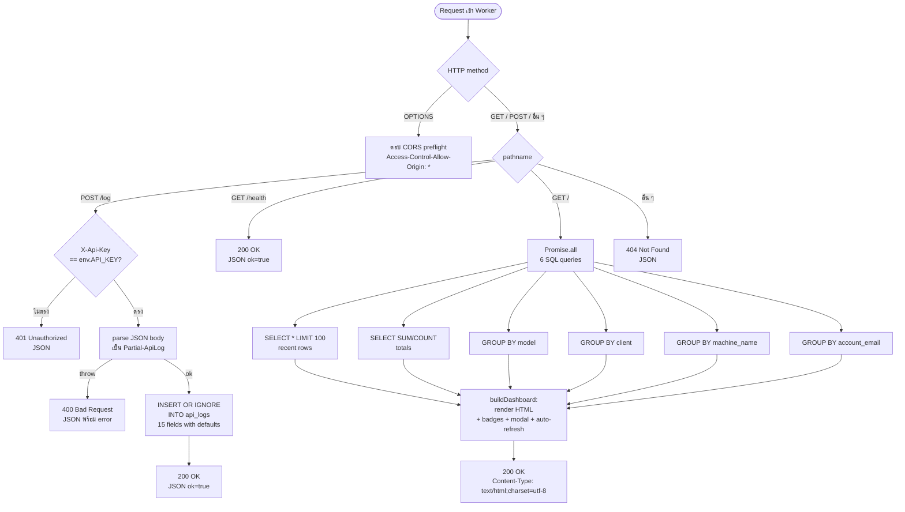
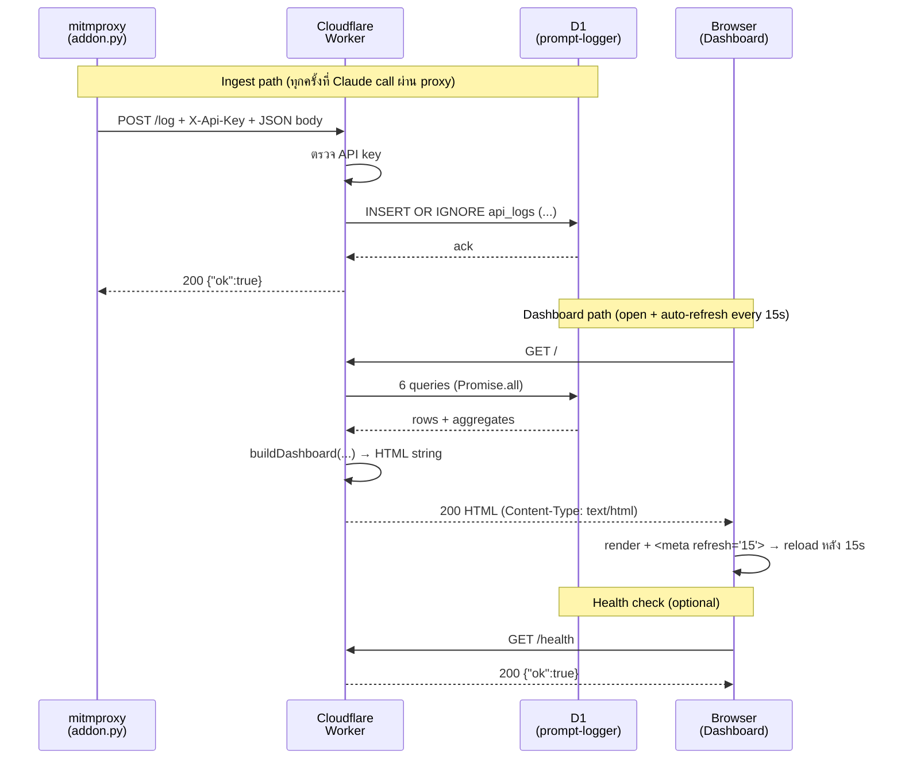

# Worker Guide — คู่มือฉบับละเอียดของฝั่ง Worker

คู่มือนี้อธิบาย **เฉพาะ** ส่วน `worker/` ของ claude-monitor — ตั้งแต่ว่าระบบนี้คืออะไร ไปจนถึง flow การทำงานทุก endpoint

> สำหรับ proxy ดูที่ [../proxy/PROXY-GUIDE.md](../proxy/PROXY-GUIDE.md)
> ภาพรวมทั้ง stack ดูที่ [../README.md](../README.md)

---

## สารบัญ

1. [ระบบนี้คืออะไร](#1-ระบบนี้คืออะไร)
2. [Flow การทำงาน](#2-flow-การทำงาน)

---

## 1. ระบบนี้คืออะไร

**Claude Monitor Worker** คือ **Cloudflare Worker** ที่ทำหน้าที่เป็น **backend ของ claude-monitor** มีงานหลัก 3 อย่าง:

1. **รับ log** จาก mitmproxy addon (ฝั่ง proxy) ผ่าน HTTP POST แล้วเขียนลง **Cloudflare D1** (SQLite-compatible serverless DB)
2. **เสิร์ฟ Dashboard** เป็น HTML page ที่ดึงข้อมูลจาก D1 มาแสดงเป็น KPI cards + ตาราง breakdown แบบ real-time (refresh ทุก 15 วินาที)
3. **Health check** สำหรับ monitoring ภายนอก

### 1.1 ตำแหน่งใน stack

```
┌──────────────┐    POST /log    ┌────────────────┐         ┌──────────────┐
│ mitm proxy   │ ──────────────► │  Cloudflare    │ ──SQL──►│ Cloudflare   │
│ (addon.py)   │  X-Api-Key auth │  Worker        │         │ D1 database  │
└──────────────┘                 │  (this folder) │ ◄──SQL──│ "prompt-     │
                                 │                │         │  logger"     │
┌──────────────┐    GET /        │                │         └──────────────┘
│ Browser      │ ──────────────► │                │
│ (Dashboard)  │ ◄── HTML ────── │                │
└──────────────┘                 └────────────────┘
```

- **Stateless** — ตัว Worker เองไม่เก็บ state ใดๆ ทุกอย่างอยู่ใน D1
- **Single endpoint** — Worker ตัวเดียวรับทั้ง ingest (`POST /log`) และเสิร์ฟ UI (`GET /`)
- **Edge-deployed** — รันบน Cloudflare edge network ทั่วโลก — latency ต่ำ ไม่ต้อง manage server

### 1.2 องค์ประกอบหลัก

| ไฟล์ / ทรัพยากร | บทบาท |
|---|---|
| [worker/src/index.ts](src/index.ts) | Worker code ทั้งหมด — routing, ingest, dashboard rendering |
| [worker/schema.sql](schema.sql) | Schema ของตาราง `api_logs` (1 ตารางเดียว) + indexes |
| [worker/migrations/](migrations/) | ALTER scripts สำหรับ schema ที่มีอยู่แล้ว |
| [worker/wrangler.jsonc](wrangler.jsonc) | Cloudflare deployment config — D1 binding + account_id |
| [worker/package.json](package.json) | scripts สำหรับ deploy / dev / migrate |
| **D1 database `prompt-logger`** | Storage จริง — ตาราง `api_logs` |
| **Secret `API_KEY`** | bearer token ใช้ auth `POST /log` (ตั้งผ่าน `wrangler secret put`) |

### 1.3 Tools / Tech stack

| Tool | Version | บทบาท |
|---|---|---|
| **Cloudflare Workers** | `compatibility_date: 2025-04-01` | runtime — serverless V8 isolate |
| **Cloudflare D1** | — | SQLite-compatible serverless database |
| **TypeScript** | ^5.5 | source language |
| **Wrangler CLI** | ^3.101 | deploy / migrate / secret management |
| **Vitest + @cloudflare/vitest-pool-workers** | ~3.2 | unit test runner |
| **@cloudflare/workers-types** | ^4.0 | TypeScript types สำหรับ Worker API |

ไม่มี dependency รันไทม์ — ทุกอย่างใช้ Web Standard API (`Request`, `Response`, `fetch`, `crypto.randomUUID`) + D1 binding ที่ Cloudflare ฉีดเข้ามาผ่าน `env.DB`

### 1.4 Endpoints

| Method | Path | หน้าที่ | Auth |
|---|---|---|---|
| `POST` | `/log` | รับ log entry จาก proxy → INSERT ลง D1 | `X-Api-Key` header ต้องตรง |
| `GET` | `/health` | Health check (`{ok: true}`) | — |
| `GET` | `/` | Dashboard HTML | — |
| `OPTIONS` | `*` | CORS preflight | — |
| (ไม่ match) | * | 404 JSON | — |

### 1.5 Database — `api_logs`

จาก [worker/schema.sql](schema.sql):

```sql
CREATE TABLE IF NOT EXISTS api_logs (
  id                    TEXT    PRIMARY KEY,
  ts                    INTEGER NOT NULL,
  client                TEXT    NOT NULL DEFAULT 'unknown',
  account_email         TEXT    NOT NULL DEFAULT '',
  machine_name          TEXT    NOT NULL DEFAULT '',
  model                 TEXT    NOT NULL DEFAULT '',
  prompt                TEXT    NOT NULL DEFAULT '',
  prompt_chars          INTEGER NOT NULL DEFAULT 0,
  response_chars        INTEGER NOT NULL DEFAULT 0,
  input_tokens          INTEGER NOT NULL DEFAULT 0,
  output_tokens         INTEGER NOT NULL DEFAULT 0,
  cache_creation_tokens INTEGER NOT NULL DEFAULT 0,
  cache_read_tokens     INTEGER NOT NULL DEFAULT 0,
  total_tokens          INTEGER NOT NULL DEFAULT 0,
  cost_usd              REAL    NOT NULL DEFAULT 0
);
```

Indexes:
- `idx_api_logs_ts` — `ts DESC` (ทุก query ของ dashboard เรียงตามเวลา)
- `idx_api_logs_model` — group by model
- `idx_api_logs_client` — group by client
- `idx_api_logs_machine` — group by machine_name
- `idx_api_logs_email` — group by account_email

**`id` คือ Primary Key** + INSERT ใช้ `INSERT OR IGNORE` → เป็น **idempotent**: ถ้า proxy ส่ง entry ซ้ำ (network retry ฯลฯ) จะไม่ duplicate

### 1.6 Dashboard ที่ผลิต

`GET /` คืน HTML page ที่ self-contained (inline CSS + 3 บรรทัด JS) มี:

- **Header** — ชื่อ + live indicator + timezone (`Asia/Bangkok`)
- **KPI cards** (6 cards) — API Calls / Input Tokens / Output Tokens / Cache Write / Cache Read / Est. Cost
- **4 breakdown tables** (วาง 4 column):
  - By Model (calls / tokens / cost)
  - By Account (email / calls / cost)
  - By Client (client tag / calls)
  - By Machine (machine_name / calls)
- **Recent API Calls** (table 100 entries ล่าสุด) — time, client badge, account, machine, model badge, prompt preview, in/out/cache↑/cache↓/total tokens, cost
- **Modal popup** — กดปุ่ม "more" บน prompt preview เพื่อดู prompt เต็ม
- **Auto-refresh** — `<meta http-equiv="refresh" content="15">` reload ทั้งหน้าเองทุก 15 วินาที

---

## 2. Flow การทำงาน

### 2.1 Flowchart รวม



### 2.2 Path 1 — `POST /log` (ingest จาก proxy)

ขั้นตอนใน [worker/src/index.ts:256-289](src/index.ts#L256-L289):

```
1. ตรวจ method + path → "POST /log"
2. อ่าน header X-Api-Key เทียบกับ env.API_KEY
   ├─ ไม่ตรง → json({ok:false, error:'Unauthorized'}, 401)
   └─ ตรง → ไปต่อ
3. await request.json() เป็น Partial<ApiLog>
   └─ ถ้า parse fail → catch → json({ok:false, error: String(e)}, 400)
4. INSERT OR IGNORE INTO api_logs (...) VALUES (?,?,?,?,...) 15 placeholders
   - ทุก field มี default value (?? operator)
   - id ?? crypto.randomUUID()  ← ถ้า proxy ไม่ใส่ id, Worker gen ใหม่
   - ts ?? Date.now()           ← ถ้าไม่ใส่ ts, ใช้เวลาที่ Worker รับ
   - อื่น ๆ → fallback เป็น '' หรือ 0
5. ตอบ json({ok:true})
```

**จุดสังเกตสำคัญ:**

- **Idempotency:** ใช้ `INSERT OR IGNORE` (ไม่ใช่ `INSERT`) — ถ้า `id` ซ้ำกับที่มีอยู่ จะ ignore เงียบ ๆ (ตอบ 200 ปกติ) → ปลอดภัยกับ retry ของ proxy
- **Defensive defaults:** ทุก field มี `?? default` — proxy ส่งฟิลด์มาไม่ครบ Worker ไม่ crash
- **No transaction:** D1 INSERT ทำเป็น 1 statement — atomic อยู่แล้ว
- **Async I/O:** `await ...run()` block จนกว่า D1 จะ commit → client ได้รับ 200 หลังเขียนจริง

**Example request:**

```http
POST /log HTTP/1.1
Host: claude-monitor-xxx.workers.dev
X-Api-Key: MySecretKey123
Content-Type: application/json

{
  "id": "906abe93-2999-4913-96ed-8de17eaf441c",
  "ts": 1778477666756,
  "client": "claude-code-vscode",
  "account_email": "",
  "machine_name": "Thanakrit",
  "model": "claude-sonnet-4-6",
  "prompt": "ทดสอบ",
  "prompt_chars": 5,
  "response_chars": 362,
  "input_tokens": 3,
  "output_tokens": 472,
  "cache_creation_tokens": 533,
  "cache_read_tokens": 44276,
  "total_tokens": 45284,
  "cost_usd": 0.02237
}
```

**Possible responses:**

| Status | Body | เมื่อไร |
|---|---|---|
| 200 | `{"ok":true}` | INSERT สำเร็จ หรือ id ซ้ำ (IGNORE) |
| 400 | `{"ok":false,"error":"..."}` | JSON parse fail / D1 error อื่น |
| 401 | `{"ok":false,"error":"Unauthorized"}` | `X-Api-Key` ไม่ตรง / ไม่ส่ง |

### 2.3 Path 2 — `GET /health`

[index.ts:292](src/index.ts#L292):

```typescript
if (pathname === '/health') return json({ ok: true });
```

ใช้ตรวจว่า Worker ยัง alive อยู่ — ไม่ query D1 ไม่มี auth ใช้กับ uptime monitor / curl ได้เลย

```powershell
curl https://claude-monitor-xxx.workers.dev/health
# {"ok":true}
```

### 2.4 Path 3 — `GET /` (Dashboard)

ขั้นตอนใน [index.ts:295-326](src/index.ts#L295-L326):

```
1. รัน 6 queries พร้อมกันด้วย Promise.all
   ├─ Q1: SELECT * FROM api_logs ORDER BY ts DESC LIMIT 100
   ├─ Q2: SELECT COUNT/SUM totals (calls, in, out, cache_read, cache_create, cost)
   ├─ Q3: SELECT model, COUNT, SUM(tokens), SUM(cost) GROUP BY model ORDER BY n DESC
   ├─ Q4: SELECT client, COUNT GROUP BY client ORDER BY n DESC
   ├─ Q5: SELECT machine_name, COUNT GROUP BY machine_name ORDER BY n DESC
   └─ Q6: SELECT account_email, COUNT, SUM(cost) GROUP BY account_email ORDER BY n DESC

2. ส่งผลทั้งหมดเข้า buildDashboard(...)
   ├─ format KPI cards (6 ตัว)
   ├─ render 4 breakdown tables (HTML)
   ├─ render Recent 100 calls table:
   │    - badges สำหรับ client + model (สีต่างกันตาม opus/sonnet/haiku และ client type)
   │    - prompt preview ตัด 140 chars + ปุ่ม "more"
   │    - format ts → Asia/Bangkok (DD/MM/YY HH:mm:ss)
   ├─ inline CSS (~150 บรรทัด) — dark theme + responsive grid
   ├─ inline JS — modal popup เปิด/ปิด
   └─ <meta refresh="15"> ให้ browser reload เอง

3. ตอบ HTML + Content-Type: text/html;charset=utf-8
```

**ทำไม Promise.all:** ทั้ง 6 query อิสระจากกัน — ส่งพร้อมกันใช้ wall-time ของ query ที่ช้าที่สุดเท่านั้น ไม่ใช่ผลรวม

**Why server-rendered HTML (ไม่ใช่ SPA + API):**

- เนื้อหา dashboard เปลี่ยนช้า (refresh 15 วินาที) — ไม่ต้องการ realtime push
- ส่ง HTML แล้ว browser parse + render เลย — 1 round-trip
- ไม่ต้องมี build step / bundler / framework runtime — Worker ส่ง string เดียว
- meta refresh ทำงานทุก browser — ไม่พึ่ง JS

### 2.5 Path 4 — CORS preflight

[index.ts:251-253](src/index.ts#L251-L253):

```typescript
if (request.method === 'OPTIONS') {
    return new Response(null, { headers: {
        'Access-Control-Allow-Origin': '*',
        'Access-Control-Allow-Headers': '*',
    }});
}
```

- รับ OPTIONS ทุก path → ตอบ allow-all
- กรณีใช้: ถ้ามี frontend อื่นที่อยู่คนละ origin อยากเรียก `/log` หรือ `/health` ผ่าน fetch
- ปัจจุบันใช้แค่ proxy (curl-like, ไม่ trigger preflight) + browser ที่เปิด dashboard เอง — ไม่ค่อยมี OPTIONS จริง แต่กันไว้

### 2.6 Path 5 — 404 fallback

[index.ts:329](src/index.ts#L329):

```typescript
return json({ ok: false, error: 'Not Found' }, 404);
```

ทุก request ที่ไม่ match path/method ใด → ตอบ JSON 404

### 2.7 Lifecycle รวม



### 2.8 Error handling — ที่ครอบคลุม

| สถานการณ์ | ผลลัพธ์ |
|---|---|
| `X-Api-Key` ไม่ตรง / ไม่ส่ง | 401 JSON |
| Body ไม่ใช่ JSON / parse fail | 400 JSON พร้อม error message |
| D1 error (network / quota / lock) | 400 JSON พร้อม error message (catch รวมกับ parse) |
| Field ขาด / type ผิด | INSERT ผ่านด้วย default ('' หรือ 0) |
| `id` ซ้ำ | IGNORE — ตอบ 200 ตามปกติ (idempotent) |
| Method ที่ไม่รองรับบน path | ตก fallback → 404 |

### 2.9 จุดสำคัญที่ควรรู้

- **D1 ไม่มี connection pooling** — ทุก query สร้าง prepared statement ใหม่ — `Promise.all` ของ 6 queries ใน path `/` คือวิธีลด total latency
- **`INSERT OR IGNORE` แทน `INSERT`** — proxy retry ได้ปลอดภัย ไม่ต้องเก็บ delivery status เอง
- **`crypto.randomUUID()` ที่ Worker** — fallback ถ้า proxy ไม่ส่ง `id` (แต่ปกติ proxy gen ให้ก่อนอยู่แล้ว)
- **`env.API_KEY`** ตั้งผ่าน `wrangler secret put API_KEY` — ไม่ commit ใน source / wrangler.jsonc
- **D1 binding** (`env.DB`) ผูกผ่าน [wrangler.jsonc:9-15](wrangler.jsonc#L9-L15) → ชี้ไป database `prompt-logger`
- **observability เปิด** (`wrangler.jsonc:6`) → log + invocation analytics ใน Cloudflare dashboard
- **Compatibility date `2025-04-01`** — lock Worker runtime version

---

## ลิงก์ที่เกี่ยวข้อง

- [worker/src/index.ts](src/index.ts) — source ทั้งหมด (332 บรรทัด)
- [worker/schema.sql](schema.sql) — table schema + indexes
- [worker/wrangler.jsonc](wrangler.jsonc) — deployment config
- [../proxy/PROXY-GUIDE.md](../proxy/PROXY-GUIDE.md) — ฝั่งที่ส่ง log มา
- [../SETUP.md](../SETUP.md) — install Worker + D1 ตั้งแต่ต้น
- [Cloudflare Workers docs](https://developers.cloudflare.com/workers/) — runtime reference
- [Cloudflare D1 docs](https://developers.cloudflare.com/d1/) — database reference
